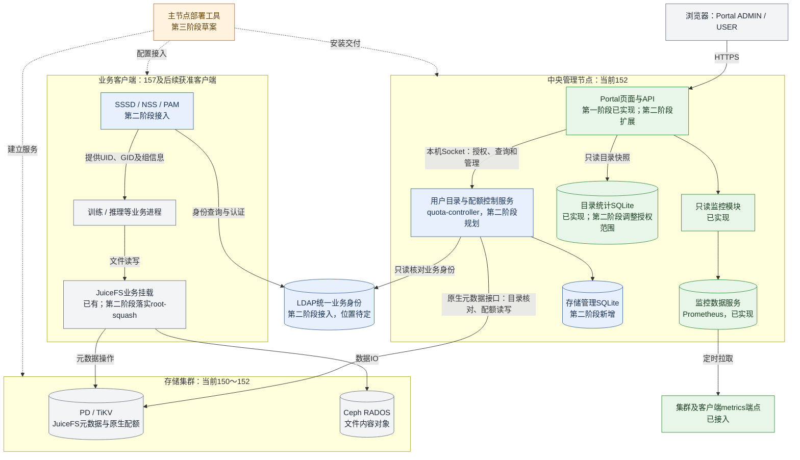
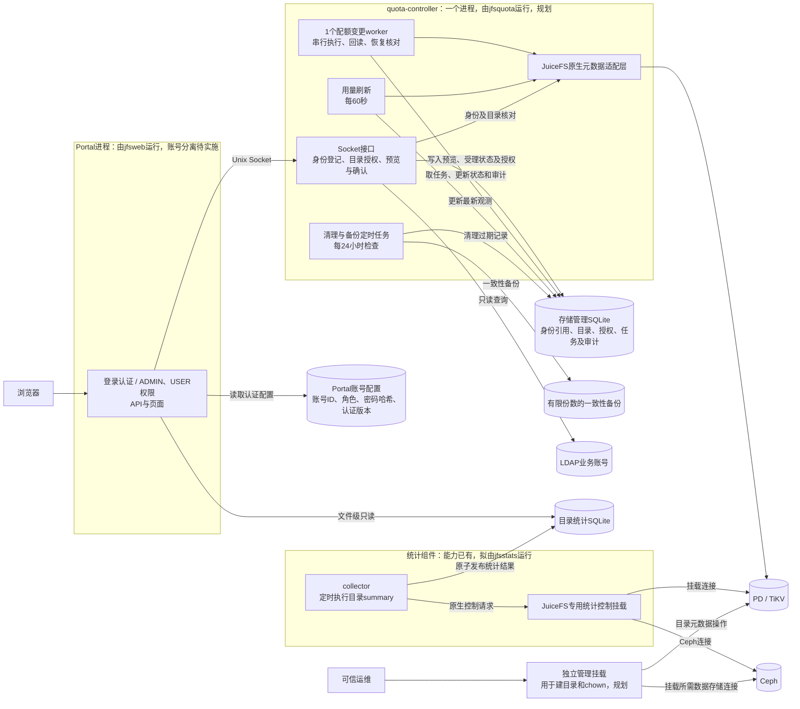
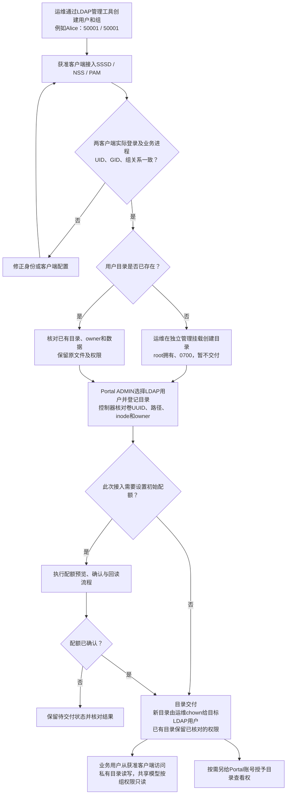
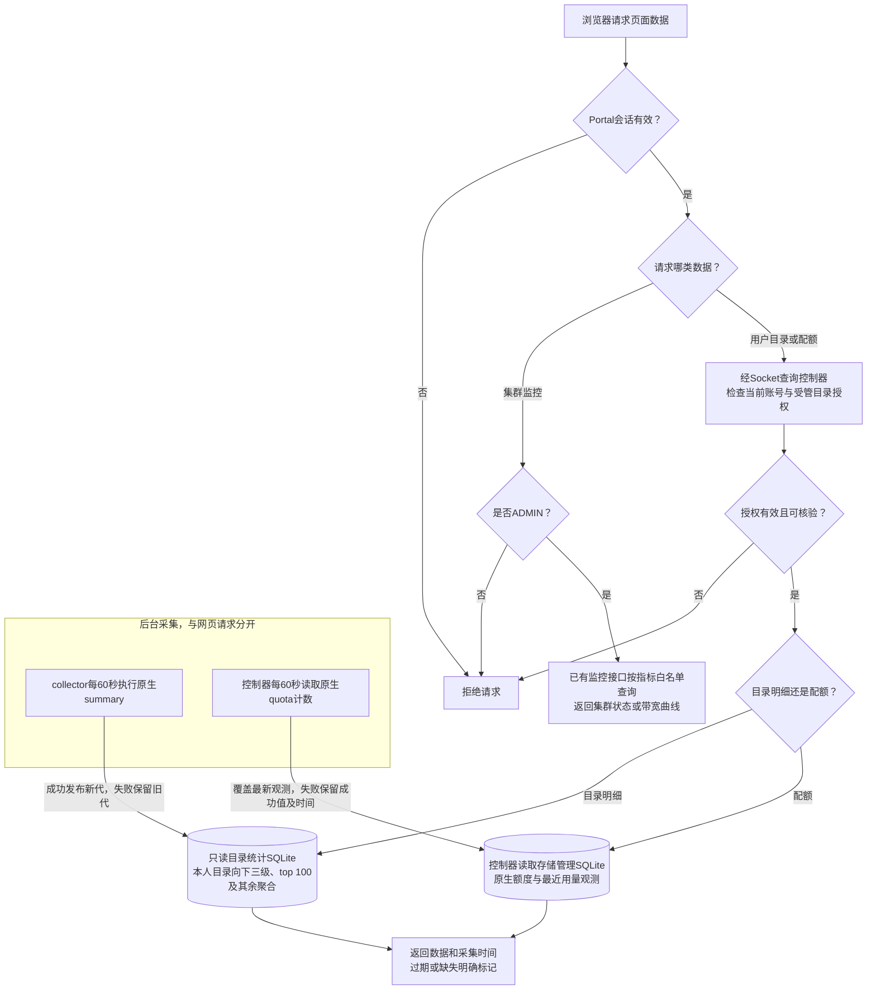
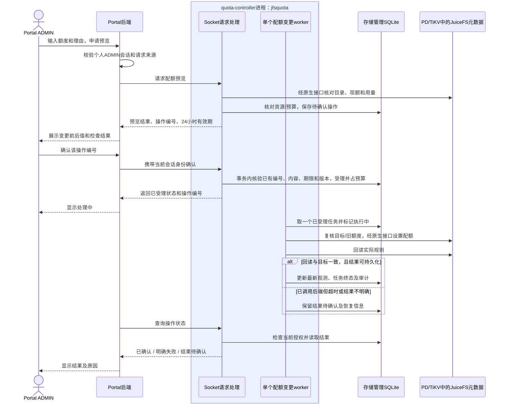
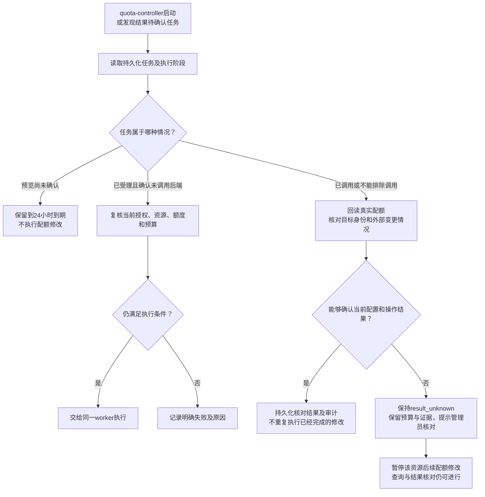
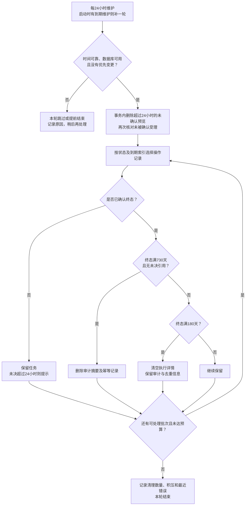
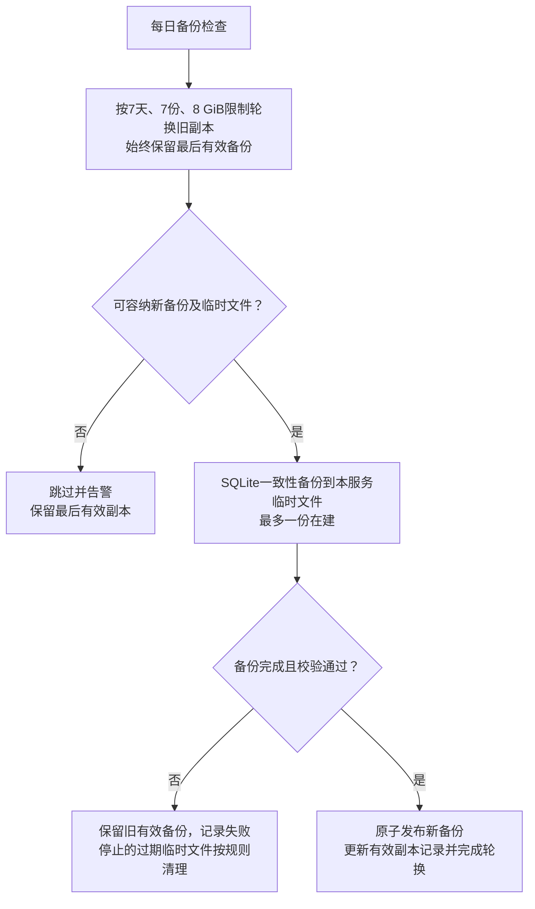
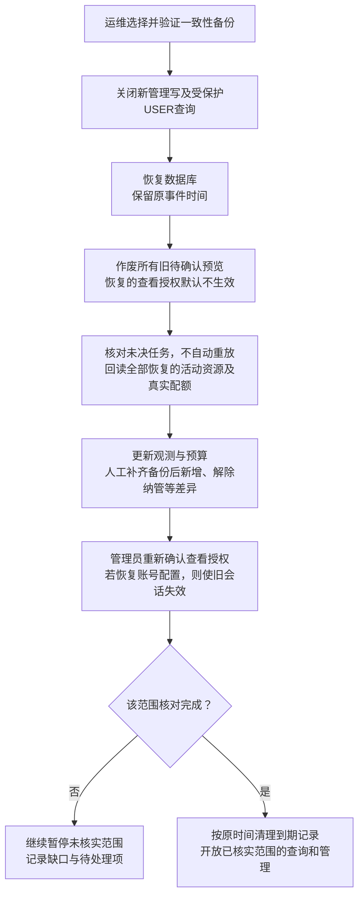
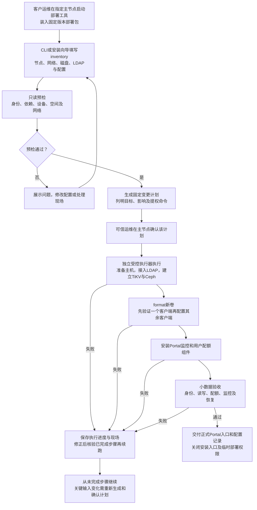

# Portal平台架构与子模块流程图

> 日期：2026-09-22。覆盖三个开发阶段，以已确认方案为依据。
> 第一阶段只读监控已实现；第二阶段用户与配额管理待开发；第三阶段快速部署为方案草案。本文展示的是“现有能力＋计划形成的整体架构”，不代表图中全部组件已上线。

图采用Mermaid，可在支持Mermaid的Markdown预览中查看和维护。绿色表示已实现能力，蓝色表示第二阶段规划，橙色表示第三阶段草案，灰色表示人员或外部基础设施。阶段状态同时写入标签，不仅依赖颜色。

## 1. 平台总架构

运行期管理组件集中在152，LDAP部署位置待确定；客户现场的主服务节点由第三阶段配置决定。实线表示运行期调用/访问方向，虚线表示安装交付关系；请求对应的返回未逐条画出。

业务文件内容不经过Portal或quota-controller。Prometheus属于已有监控能力；其内部存储不在第二阶段重新设计。目录采集、独立管理挂载等细节在下图展开。

## 2. 第二阶段内部组件：服务进程、worker与数据库

`jfsweb`、`jfsquota`、`jfsstats`是拟使用的本地Linux服务账号。方框内列出进程职责；worker是quota-controller进程内的一个Go协程，没有独立PID。第一版只有一个配额变更worker，其他定时工作不计入这一数量。

Web不直接打开存储管理库，通过Socket取得授权与配额结果。quota-controller使用TiKV凭据，不需要Ceph keyring；统计挂载和管理挂载各自独立。管理挂载由可信运维控制，不启用业务挂载的root-squash。统计挂载保留原生控制接口所需能力，不用作目录交付入口。

## 3. 子模块流程：LDAP身份接入与目录交付

本期运维通过LDAP产品自己的管理工具开户；Portal只查询并登记已有业务身份。Portal登录账号仍单独管理，不自动等于同名LDAP账号。

对已有且正在写入的目录，若要求首次计数和设限期间没有无配额写入窗口，由运维暂停该目录写任务。LDAP停用影响后续认证，已有进程需另行处理；撤销Portal查看权只影响网页访问。

## 4. 子模块流程：页面查询与后台采集

图中按第二阶段目标授权逻辑展示。现有监控、目录采集能力继续复用；原生配额采集和受管目录授权由新控制器提供。

页面请求不临时跑`du`或递归扫描；配额用量来自原生quota计数。目录统计无法读取0700私有目录时，显示明细不可用，不为采集放宽权限。配额和目录页面按30秒刷新、180秒标记过期；撤权按当前授权立即判断，不等待刷新周期。

## 5. 子模块流程：一次配额修改

下图中的Socket接口与worker属于同一个quota-controller进程；SQLite中的操作表承担持久化队列，不需要另部署消息队列。

未知、过期或已清理编号不能创建新任务；已受理编号重试返回原结果。执行前检查未通过则记录明确失败，不调用后端。调用后审计无法落盘时，不能向页面报告成功，重启后按未决核对。各任务按单worker执行，但这不会阻止可信root从外部CLI修改配额，日常变更仍应统一经过控制器。

## 6. 子模块流程：异常任务与进程重启恢复

这是普通服务重启的恢复。恢复旧数据库备份还需执行第8节的授权及资源核对。

只读到原来的额度，不能据此断定任务从未生效：也可能成功后又被其他管理操作改回。恢复应核对上下文，不能以此为由盲目重试。结果不明的任务不按超时自动删除或伪装为成功。

## 7. 子模块流程：过期数据清理

本流程仅清理Portal管理记录。未确认预览和已受理任务的清理条件不同；终态保留期限从实际`terminal_at`计算。

每批最多1000条，每轮最多10批或30秒。当前观测覆盖更新；在用身份、目录及授权不因年龄过期。空间或任务数量达到门槛时拒绝新建管理任务，保留未决记录。删除记录后SQLite空间可复用，文件不一定立即缩小。完整参数见[清理与备份设计](../stages/02-user-quota/features/juicefs-user-quota-management/USER-AND-QUOTA-MANAGEMENT-RESEARCH-20260914.md#1185-过期数据清理空间与备份)。

## 8. 子模块流程：有界备份与备份恢复

### 8.1 每日备份

### 8.2 恢复管理数据库

管理库备份不替代TiKV或Ceph备份。还原管理库不能将TiKV真实配额自动覆盖成备份中的旧值，也不能凭当前额度重建缺失的历史审计。

## 9. 子模块流程：第三阶段客户现场快速部署

以下为独立安装工具流程，状态为设计草案。其完整交付依赖第二阶段功能验收；运行中的Portal ADMIN会话不直接取得主机root或磁盘格式化权限。

安装工具退出后，Portal按运行期权限继续工作，业务客户端直接访问存储集群。主节点可能同时承担存储或LDAP角色，其整机故障影响取决于这些组件的冗余，不能等同于仅停止Portal进程。

## 10. 对应文档与维护规则

| 内容 | 依据 |
|---|---|
| 三阶段范围与状态 | [总体开发计划](../DEVELOPMENT-ROADMAP.md) |
| 已实现的监控、目录统计、刷新周期 | [第一阶段系统功能说明](../stages/01-readonly-monitoring/CURRENT-STAGE-SYSTEM-OVERVIEW-20260914.md) |
| LDAP路线A与root边界 | [LDAP实施说明](../stages/02-user-quota/features/juicefs-user-quota-management/JUICEFS-LDAP-USER-MANAGEMENT-IMPLEMENTATION-NOTES-20260922.md) |
| 第二阶段开发安排 | [第二阶段总开发计划](../stages/02-user-quota/USER-AND-QUOTA-MANAGEMENT-DEVELOPMENT-PLAN-20260922.md) |
| 配额接口、任务、恢复和清理 | [配额开发计划](../stages/02-user-quota/features/juicefs-user-quota-management/JUICEFS-QUOTA-MANAGEMENT-DEVELOPMENT-PLAN-20260922.md) |
| 快速部署流程 | [第三阶段部署方案](../stages/03-deployment/CUSTOMER-DEPLOYMENT-DESIGN-20260922.md) |

具体字段、接口及保留参数以对应专题为准；变更时同步本图相关节点和连接。图中组件代表职责或数据载体，只有明确标为“进程”的边界才表示进程划分，不按每个方框新增一个服务。
