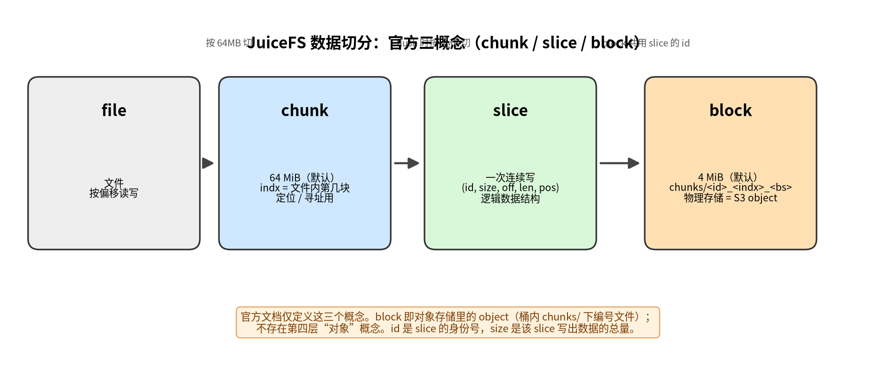
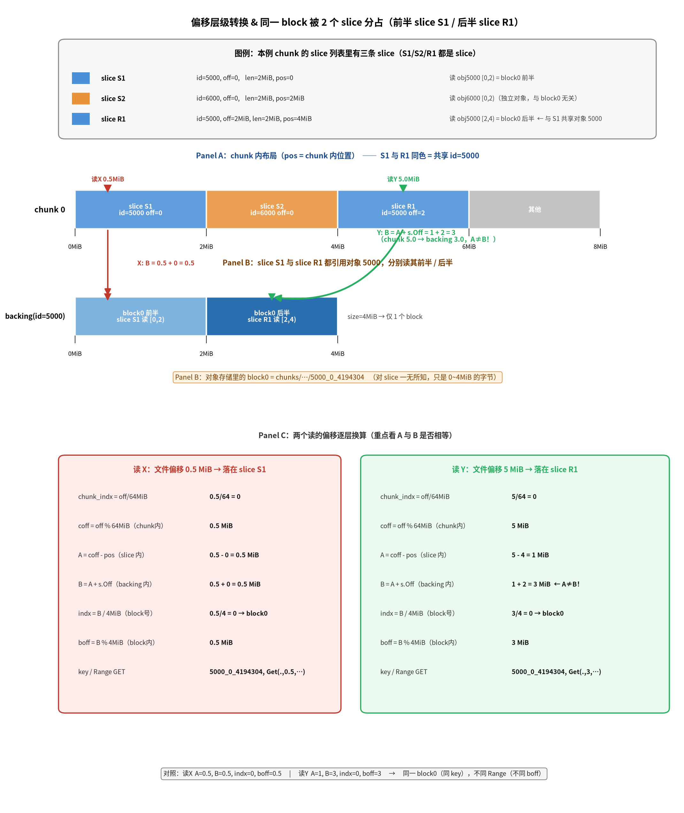
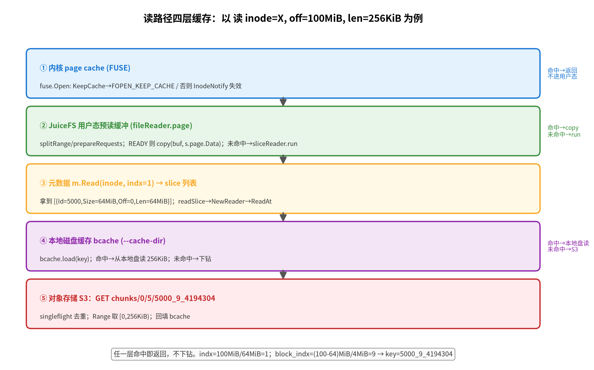

# JuiceFS 数据切分模型与读路径流程分析：chunk / slice / block / id 与多级缓存

> 文档类型：架构流程分析（内部存档）
> 作者：opencode 会话整理　｜　日期：2026-09-18　｜　修订：v2（修正"对象"误用、补图）
> 源码基线：`/home/lilingfeng/project/juicefs`（`pkg/meta`、`pkg/chunk`、`pkg/vfs`）
> 阅读对象：已了解通用文件系统概念、需要厘清 JuiceFS 元数据/对象存储双层切分与读路径缓存的读者
> 关键结论速览：见 §六；所有论断均附 `file:line` 代码出处。
> 术语约定：本文严格沿用 JuiceFS 官方三概念（chunk / slice / block）。**"对象"仅指"对象存储（S3 等）里的 object"，而 block 就是这种 object**——不存在第四层"对象"概念（详见 §一）。早期版本曾把"slice 的 backing 数据"误称为"对象"，本次已统一改正。

> **版本与本项目卷参数批注（2026-09-21）**：本文源码基线是1.3.1开发树，文中的“block默认4MiB”
> 是格式化默认值，不是本项目测试卷的实际值。本项目权威1.4.1测试卷`BlockSize=256KiB`；涉及
> randrw、缓存文件大小或对象请求数时，必须以该卷实际格式为准，并与
> `doc/perf-analysis/06-RANDRW-ARCHITECTURE-QA-20260918.md`交叉核对，禁止把本文默认值直接套用。

---

## 一、三层切分与三种"编号"

> 官方架构文档（<https://juicefs.com/docs/community/architecture/#how-juicefs-store-files>）只定义三个概念：
> - **chunk**："each file is composed of one or more chunks. Each chunk has a maximum size of 64 MB." 作用是定位/寻址。
> - **slice**："each slice represents a single continuous write." chunk 与 slice 都是逻辑数据结构。
> - **block**："slices are further split into individual blocks (default maximum size of 4 MB)." "blocks represent the final physical storage form and serve as the smallest storage unit for the object storage." 桶内 `chunks/` 下那些编号文件就是 block。
>
> 即：**block == 对象存储里的 object**。`id` 是 slice 的身份号（不是独立"对象"层），`size` 是该 slice 写出数据的总量。本文不再使用"对象(id)"这种含糊简称，统一说"slice 的 backing 数据"或直接说"slice"。



JuiceFS 把一个文件切成三层，每层有自己的标识。三者**绝对不要混**：

| 概念 | 标识/编号 | 取值范围 | 物理存放 | 标识/Key |
|---|---|---|---|---|
| **chunk**（默认 64 MiB 逻辑块） | `indx` | **per-file**（文件内第几个 64 MiB） | 元数据引擎（Redis / DB / TKV） | `chunkKey(inode, indx)`，如 Redis `c<inode>_<indx>` |
| **slice**（数据引用） | `id` | **全局** | 元数据引擎（作为 chunk 的组成项） | 无独立 S3 Key；用其 `id` 去命名下属 block |
| **block**（默认 4 MiB；= 对象存储里的 object） | `<id>_<indx>` | 全局（由 id + 块内索引定位） | 对象存储（S3 等） | `chunks/<...>/<id>_<indx>_<blockSize>` |

常量出处：
- `ChunkSize = 1 << ChunkBits // 64M`（`pkg/meta/interface.go:41`）
- `block-size` 默认 `"4M"`（`cmd/format.go:152`），经 `fixObjectSize` 规整到 `[64KiB, 16MiB]`（`cmd/format.go:210-221`）

关系链：
```
file → 多个 chunk（64MiB 切，indx 标识）
chunk → 多个 slice（元数据里一个 slice 列表；每 slice 带全局 id+size+off+len）
slice(id) → 多个 block（该 slice 的 backing 数据按 4MiB 切成 N 个 block，共用该 slice 的 id，靠块内索引区分）
```

---

## 二、slice 结构体逐字段

源码 `pkg/meta/slice.go:21-29`：

```go
type slice struct {
	id    uint64
	size  uint32
	off   uint32
	len   uint32
	pos   uint32
	left  *slice
	right *slice
}
```

| 成员 | 类型 | 含义 | 出处 |
|---|---|---|---|
| `id` | `uint64` | 全局 slice 身份号（一个 slice 一个，由 `NewSlice` 分配）。`id==0` 表示空洞/稀疏零填充区 | slice.go:61 `newSlice(pos, 0, 0, 0, ...)` |
| `size` | `uint32` | 该 slice 写出数据的总量（= flush 时上传的字节数；`newSlice` 形参名 `cleng`） | slice.go:38 |
| `off` | `uint32` | 本 slice 在其 backing 数据内的**起始偏移**（COW 子段时 >0）；读数据时从 backing 数据 `off` 处开始读 | slice.go:39 |
| `len` | `uint32` | 本 slice 覆盖的字节数（从 backing 数据 `off` 处读 `len` 字节） | slice.go:40 |
| `pos` | `uint32` | 本 slice 在 chunk 中的**逻辑起始位置**；BST 的排序键 | slice.go:36 |
| `left` | `*slice` | 左子节点（`pos` 比当前小的段） | slice.go:41 |
| `right` | `*slice` | 右子节点（`pos` 比当前大的段） | slice.go:42 |

要点：
- slice 是一棵**按 `pos` 排序的二叉搜索树（BST）节点**。`visit`（slice.go:81）中序遍历还原完整 chunk；`cut`（slice.go:55）按 `pos` 切分。
- 序列化只存 `pos/id/size/off/len` 共 24 字节（`sliceBytes` slice.go:91，`marshalSlice` slice.go:93）；`left/right` 是纯内存指针，不落盘。
- 公开结构 `Slice{Id, Size, Off, Len}`（`pkg/meta/interface.go:317-322`）注释 "Slice is a slice of a chunk. Multiple slices could be combined together as a chunk." —— 比 private slice 少 `pos/left/right`。

---

## 三、slice id 的分配与 block Key 格式

### 3.1 id 是全局编号，不是 per-chunk

`NewSlice`（`pkg/meta/base.go:1654-1668`）：

```go
func (m *baseMeta) NewSlice(ctx Context, id *uint64) syscall.Errno {
	...
	if m.freeSlices.next >= m.freeSlices.maxid {
		v, err := m.en.incrCounter("nextChunk", sliceIdBatch)  // 全局计数器
		...
		m.freeSlices.next = uint64(v) - sliceIdBatch
		m.freeSlices.maxid = uint64(v)
	}
	*id = m.freeSlices.next
	m.freeSlices.next++
	return 0
}
```

- 通过 `m.en.incrCounter("nextChunk", sliceIdBatch)`（base.go:1658）递增**全局**计数器 `nextChunk`，跨所有文件、所有 chunk 单调递增。id 全局唯一。
- 实际为**批量取号**：客户端本地缓存一段 id 区间 `freeSlices.next..maxid`，减少对元数据引擎的请求，但号源仍是全局计数器。
- ⚠️ **命名陷阱**：计数器名叫 `nextChunk`，但它发的是 **slice id**（元数据层历史上把 slice 叫 chunk，见 `dump.go:42 NextChunk`、`:79 Chunkid`）。真正"chunk 的编号"是 `indx`，那个才是 per-file 的（文件内第几个 64 MiB），与全局 id 完全两回事。
- 计数器名表见 `pkg/meta/utils.go:45`（含 `nextInode`、`nextChunk`、`nextSession`、`nextTrash`）。

### 3.2 id 生成时机：数据 flush 上传之前

调用链（`pkg/vfs/writer.go`）：

```
sliceWriter.flushData()                         // writer.go:106
  → s.prepareID(meta.Background(), true)        // writer.go:111 → :68
    → f.w.m.NewSlice(ctx, &id)                  // writer.go:74 → base.go:1654  分配全局 id
    → s.id = id                                 // writer.go:82
    → s.writer.SetID(s.id)                      // writer.go:92  交给 chunk-store writer
  → s.writer.Finish(int(s.length))             // writer.go:118  上传 block（key 带 id）
  ...
commitThread:                                   // writer.go:181
  → meta.Write(inode, indx, s.off, Slice{Id: s.id, Size: s.length, Off: s.soff, Len: s.slen}, ...)  // writer.go:199-200
```

顺序：**先取全局 id → 再上传 block（block Key 带此 id）→ 后写元数据 slice（带同一 id）**。

### 3.3 block Key 格式（对象存储内）

`rSlice.key(indx)`（`pkg/chunk/cached_store.go:73-78`）：

```go
func (s *rSlice) key(indx int) string {
	if s.store.conf.HashPrefix {
		return fmt.Sprintf("chunks/%02X/%v/%v_%v_%v", s.id%256, s.id/1000/1000, s.id, indx, s.blockSize(indx))
	}
	return fmt.Sprintf("chunks/%v/%v/%v_%v_%v", s.id/1000/1000, s.id/1000, s.id, indx, s.blockSize(indx))
}
```

逐段拆解：

| 段 | 含义 |
|---|---|
| `chunks/` | 对象存储固定前缀，所有数据块都在这下面 |
| `<id/1000/1000>` | 分桶目录（id/1000000），避免单目录对象过多影响 S3 性能；HashPrefix 模式改用 `<id%256>` |
| `<id/1000>` | 二级分桶（id/1000） |
| `<id>` | 全局 slice id（一个 slice 一个） |
| `<indx>` | 该 slice 的 backing 数据内 block 索引（0,1,2…，每 BlockSize 字节切一个） |
| `<blockSize>` | 该 block 实际字节数（末块可能不足 4 MiB） |

示例（id=5000）：`chunks/0/5/5000_9_4194304`（5000/1000/1000=0，5000/1000=5）。

---

## 四、slice 是否 block 对齐 / 是否含部分 block

### 4.1 slice 范围不要求 block 对齐，也不要求整数倍

- `slice.off`/`slice.len` 是任意 `uint32`，无对齐约束（slice.go:21-29；`marshalSlice` 直接存原值，slice.go:93-101）。
- **普通 VFS 写路径**：`sliceWriter.soff` 只在定义（writer.go:57）和读取（writer.go:199）处出现、从不被赋值，故恒为 0。即 `slice.Off=0, Len=slen=本次写入字节数`，覆盖整个 backing 数据 `[0, slen)`。但 `slen` 不一定是 BlockSize 的整数倍——写 5 MiB → Len=5 MiB，写 100 B → Len=100 B。
- **COW/复制路径**（`CopyFileRange`）：可产生任意 `Off/Len` 的子段。`pkg/meta/redis.go:2505` `marshalSlice(0, s.Id, s.Size, s.Off+skip, s.Len-skip)` —— `Off=s.Off+skip`、`Len=s.Len-skip`，backing 数据内任意起点/长度，完全可能 mid-block。同一 id 的 backing 数据被多个 slice 共享，靠引用计数 `sliceRefs`（redis.go:2501 `m.sliceKey(s.Id, s.Size)` 配合 `HIncrBy`）实现去重。
- **测试铁证**：`pkg/meta/base_test.go:1939` `{sliceIds[0], 200, 50, 50}` = `{Id, Size=200, Off=50, Len=50}`，Off=50、Len=50，既非 4 MiB 倍数、也非 block 对齐。

### 4.2 slice 可以只包含某个 block 的一部分

两种典型情况：

1. **末尾不足一块**：slice 的 `size` 不是 BlockSize 整数倍时，最后一块为部分块。
   `blockSize(indx) = min(BlockSize, length - indx*BlockSize)`（cached_store.go:65-71）。
   如 size=5 MiB → block0=4 MiB、block1=1 MiB（部分）；覆盖整个 backing 数据的 slice 含这个 1 MiB 部分块。
2. **mid-block 子段（COW/复制）**：slice 引用 `[Off, Off+Len)` 起止都在块内。
   上文测试例 `{Size=200, Off=50, Len=50}`：slice 的 backing 数据才 200 B（一个 200 B 的部分 block0），slice 只取 [50,100)——整个 slice 只占一个 block 的一部分。

### 4.3 读路径为"不对齐"而生

`rSlice.ReadAt`（`pkg/chunk/cached_store.go:96-213`）核心逻辑证明 slice 可任意区间：

```go
indx := s.index(off)                       // off/BlockSize 落在第几块      :105
boff := off % s.store.conf.BlockSize       // 块内偏移，可非 0              :106
blockSize := s.blockSize(indx)             // 该块实际大小，末块<BlockSize  :107
if boff+len(p) > blockSize { ... }        // 跨块则递归逐块读              :108
key := s.key(indx)                         // chunks/.../<id>_<indx>_<bs>   :129
...
store.storage.Get(key, int64(boff), int64(len(p)), ...)  // Range GET，只取块内 [boff,boff+len)  :175
```

`boff`（块内偏移）、`blockSize(indx)`（块实际大小）、跨块递归、以及 `Get(key, boff, len)` 的 Range 取——这套机制存在的唯一原因，就是 slice 的 `[off, off+len)` 可在任意字节位置起止、可跨块、可只占块的一部分。若 slice 强制 block 对齐，这些都不需要。

### 4.4 一个 block 可分属不同 slice（前半 / 后半分别归属）

**结论：可以**——同一个物理 block 的前一半和后一半可分别属于不同的 slice。但有一个硬约束：block 的 Key 含 `<id>`，所以**只有共享同一个 `id`（同一 backing 数据）的 slice 才可能引用同一个 block**；不同 `id` 的 slice 永远不会碰同一个 block（Key 前缀就不同）。

即："一个 block 属于不同 slice" ⟺ "不同 slice 共享同一个 id"。

#### 成因一：compaction 的 `cut` 把 slice 从块中间劈开

`cut(pos)`（`pkg/meta/slice.go:55-79`）在任意 `pos` 处切分 slice 树，中段分支：

```go
} else if pos < s.pos+s.len {
	l := pos - s.pos
	right = newSlice(pos, s.id, s.size, s.off+l, s.len-l)  // 同 id，off 偏移 l
	right.right = s.right
	s.len = l          // 原 slice 截到 [s.pos, pos)
	s.right = nil
	return s, right
}
```

切出的两半 `s` 与 `right` **共用同一个 `s.id`/`s.size`**，仅 `off/len` 不同。当 `pos` 落在块中间（非 block 对齐）时，`s` 取该 block 前半、`right` 取后半。`cut` 在 `buildSlice`（slice.go:140-141）每插入一个新 slice 时于 `s.pos`、`s.pos+s.len` 各切一次——即**覆盖写时按新写边界劈开旧 slice**，边界是任意字节位置。

#### 成因二：COW / CopyFileRange 复用源 id

`pkg/meta/redis.go:2505` `marshalSlice(0, s.Id, s.Size, s.Off+skip, s.Len-skip)` 复用源 id、产生 `Off` 非 0 的子段 slice，同样可让一个 block 被多个 slice 分占（由 `sliceRefs` 引用计数跟踪，redis.go:2501）。但因 `ChunkSize(64MiB)` 是 `BlockSize(4MiB)` 的整数倍，chunk 边界处的复制切分是 block 对齐的；mid-block 的分占主要来自上面 compaction 的 `cut`。

#### 具体例子（配图 fig2，COW 场景）

设 chunk 0 的 slice 列表里有三条 slice——**S1、S2、R1 都是 slice**（详见下图顶部图例）：

| slice | id | off | len | pos（chunk内） | 读哪段 backing | 对应 block |
|---|---|---|---|---|---|---|
| **S1** | 5000 | 0 | 2 MiB | 0 | obj5000 `[0,2)` | block0 前半 |
| **S2** | 6000 | 0 | 2 MiB | 2 MiB | obj6000 `[0,2)` | 另一对象的 block（与 5000 无关，仅作对照） |
| **R1** | 5000 | 2 MiB | 2 MiB | 4 MiB | obj5000 `[2,4)` | block0 后半 |

- 对象 5000（size=4 MiB）只切出 1 个 block：`block0 = chunks/.../5000_0_4194304`，覆盖 backing `[0,4MiB)`。
- **S1 与 R1 都引用对象 5000**（COW / CopyFileRange 复用同一对象，靠 `sliceRefs` 引用计数跟踪）：S1 取前半 `[0,2)`、R1 取后半 `[2,4)`。这就是"一个 block 的前半 / 后半分属两个 slice"。
- **S2 引用另一个对象 6000**（独立 backing），仅作对照——展示"不同 id 的 slice 不共享 block"。
- **"R1" 只是给这第三条 slice 起的名字**：R 取自 `cut` 返回的 `right`（成因一里旧 slice 被劈成的后半即 right slice）；本例 R1 由 COW 产生，泛指"另一条引用同一对象 5000 的 slice"。它不是 block、不是特殊实体，就是一条普通 slice。
- **slice 由写 / COW 产生，不由读产生**：S1/S2/R1 是先前的写（flush 上传 + `meta.Write` 登记，writer.go:199-200）和 COW/CopyFileRange（redis.go:2499-2512 `marshalSlice` 复用源 id）产生的，已存于元数据。图里的**读 X、读 Y 不创建任何 slice**——它们只是查询这个 slice 列表、算出要取哪个 block（见 §五读路径：`m.Read`→`dataReader.Read`→`readSlice`→`rSlice.ReadAt`，全程不 `NewSlice`、不 `meta.Write`）。

于是 **block0 的前半属于 S1、后半属于 R1，两个不同 slice 却同一个 block**。读时各取各半（见 §4.5/§4.6 与下图 Panel C）：S1 → `Get(key, 0, 2MiB)`；R1 → `Get(key, 2MiB, 2MiB)`。同一个 Key、两次 Range GET、不同字节区间。



上图：顶部**图例**明确三条 slice 的 `(id, off, len, pos)` 与各自读取的 backing 段。
- **Panel A**：chunk 内布局，S1 与 R1 同色（共享 id=5000）；标出读 X（0.5MiB，落 S1）、读 Y（5MiB，落 R1）两个落点。
- **Panel B**：对象存储里的 block0（id=5000 的 backing 数据按 4MiB 切出的那一段），前半 S1 读 / 后半 R1 读；key `chunks/…/5000_0_4194304` 对 slice 一无所知。
- **Panel C**：读 X / 读 Y 的偏移逐层换算——重点看 **A（slice 内）≠ B（backing 内）** 的情形（读 Y：A=1，B=3）。

#### 不会发生的情况

- **两个不同 `id` 的 slice 共享一个 block**：不可能，Key 前缀 `<id>` 不同。
- **普通顺序写（无覆盖、无 COW）**：每次 flush 拿新 id、slice 覆盖整个 backing 数据 `[0,slen)`，各 slice 各自的 block，互不共享。

### 4.5 block 不存 slice 归属，"前半 / 后半"靠 slice.off 现场算

承接 §4.4 的自然追问：block"由 id + 块内索引定位"后，若它只有前半或后半属于某 slice，怎么区分？

**答案：block 里根本不记录"哪一半属于哪个 slice"——这个区分是"算出来的"，不是"存着的"。**

#### block 是"哑"字节容器，不认识 slice

一个 block 是某 slice（id）的 backing 数据按 BlockSize 切出的一段原始字节，Key `chunks/.../<id>_<indx>_<blockSize>`。它只知道自己存的是 backing 数据 `[indx*BlockSize, …)` 这段字节。Key 末尾的 `<blockSize>` 只标明**这块本身多少字节**（末块可能不足 4 MiB，供 Range 有效性判断，`cached_store.go:1129 parseObjOrigSize`），**完全不含任何 slice 信息**。

#### 区分靠 slice 自己的 `off/len` 现场算

slice 在元数据里是条记录 `(id, size, off, len, pos)`，声明"我要本 slice 的 backing 数据 `[off, off+len)` 这段字节"。读时纯算术把这段映射到 block + 块内区间（`cached_store.go:96-129`）：

```go
indx = off / BlockSize          // 落在第几块        :105
boff = off % BlockSize         // 块内偏移          :106
key  = chunks/.../<id>_<indx>  // 块 Key            :129
Get(key, boff, len)            // Range 取这段      :175
```

"前一半 / 后一半"不是 block 上做的标记，而是**不同 slice 的 `off` 算出不同的 `boff`**。

#### 对照 §4.4 例子（slice id=5000，block0=4MiB）

`block0 = chunks/.../5000_0_4194304`，存的是 backing 数据 `[0,4MiB)` 字节，对 slice 一无所知：

- `S1 = {id=5000, off=0, len=2MiB}` → `off=0` → `boff=0` → `Get(key, 0, 2MiB)` 取前半
- `R1 = {id=5000, off=2MiB, len=2MiB}` → `off=2MiB` → `boff=2MiB` → `Get(key, 2MiB, 2MiB)` 取后半

完整的逐层换算（含读 X / 读 Y 两个例子）见 §4.6 配图 **fig2 Panel C**。

两次请求打到**同一个 Key**，仅 Range 的起点/长度不同。block 没有"这块归 S1、那块归 R1"的任何账，只是被动响应"给我 `[boff, boff+len)` 这段字节"。两个 slice 各发各的 Range GET，互不干扰，block 状态无关（stateless）。

#### slice→block 是单向、算术推导，无反向映射

- 元数据只存 chunk 的 slice 列表 `(pos,id,size,off,len)`；block 是物理对象，**不带反查 slice 的信息**。
- "哪些 slice 引用了 block0"这类信息**不存在于任何单点**——GC 时靠扫描所有 slice、各自算出 block Key 来重建存活块集合（`cmd/gc.go`）。
- block 既不会"被某 slice 独占"，也不"标记半块归属"；半块归属纯粹是每个 slice 用自己的 `off` 算出的读取区间。

一句话：**不存在"区分"这个动作——block 不持有 slice 信息，每个 slice 用自己的 `off/len` 算出要读 block 的哪一段、发 Range GET 去取；前半/后半之别就是 `boff` 不同，全在 slice 侧算完。**

### 4.6 `indx = off/BlockSize` 里的 `off` 是哪个？（A vs B 命名澄清）

承接 §4.5 的换算公式，一个高频混淆点："`indx = off/BlockSize`（cached_store.go:105）里的 `off`，是相对 slice 的偏移，还是相对文件 / backing 数据的偏移？算出的 `indx` 是全局索引还是 slice 内索引？"

**答案：这里的 `off` 是 ReadAt 的形参 = backing 数据内偏移（记作 B），既不是文件偏移，也不是 slice 内偏移；`indx` 是该 slice（id）内的 block 索引、0 起算、per-slice（per-id），不是全局。**

代码里有两个同名 `off` 形参，值不同，是混淆根源：

| 变量 | 所在函数 | 初值 | 语义 |
|---|---|---|---|
| `off`（A） | `readSlice` 形参 `reader.go:809` | 调用方传 `coff - pos`（reader.go:852） | **slice 内偏移**（相对 slice 数据起点） |
| `off`（B） | `rSlice.ReadAt` 形参 `cached_store.go:96` | 调用方传 `A + s.Off`（reader.go:823） | **backing 数据内偏移**（绝对 [0, s.Size)） |

桥就是 reader.go:823 那行 `reader.ReadAt(ctx, p, off+int(s.Off))`：`A（slice 内）+ s.Off = B（backing 内）`。`indx = B/BlockSize` 用的是 B，不是 A。

用 §4.4 的 R1 验证（R1={id=5000,size=4MiB,off=2MiB,len=2MiB}@pos=4MiB，读 coff=3MiB）：

```
A = coff - pos = 3 - 4 = 1 MiB            ← slice 内偏移
B = A + s.Off = 1 + 2 = 3 MiB             ← backing 内偏移（ReadAt 入参，indx 用它）
indx = B/4 = 0     boff = B%4 = 3 MiB     → Get(5000_0_4194304, 3MiB, …)
```

A=1、B=3 不同——`indx` 用的是 B。若误用 A，换个数（如 A=5、s.Off=2 → B=7 → indx=1）就会算错块。两个读 X/Y 的完整换算见下图 **fig2**（本节首图）。

**图读三点**（对应 fig2）：
1. `indx = B/BlockSize` 用 B（backing 内），不是 A（slice 内）；Y 里 A=1、B=3，差异来自 `s.Off`。
2. `s.Off` 是把"slice 内偏移 A"翻译成"backing 内偏移 B"的桥；进 `indx` 之前必先 `+ s.Off`。
3. S1、R1 读同一 block0（同 key），靠不同 `boff` 的 Range GET 各取前后半——block 自身不带任何 slice 归属信息。

---

## 五、读路径全流程：以"读 inode=X, off=100 MiB, len=256 KiB"为例

### 5.1 坐标计算

```
ChunkSize = 64 MiB = 67108864 B
BlockSize = 4 MiB = 4194304 B
off = 100 MiB = 104857600 B
len = 256 KiB = 262144 B

indx = off / ChunkSize = 100MiB / 64MiB = 1          ← 落在第 2 个 chunk [64MiB,128MiB)
coff = off % ChunkSize = 100MiB - 64MiB = 36 MiB      ← chunk 内偏移
[100MiB, 100.25MiB) 完全落在 chunk 1 内，单 chunk 读
```

设 chunk 1 的 slice 列表（元数据 `Read(inode, indx=1)` 返回，经 `buildSlice` 拼接后）为单条：`Slice{Id=5000, Size=64MiB, Off=0, Len=64MiB}`。

在该 slice 内读取：backing 内偏移 = `coff + s.Off` = `36MiB + 0` = `36MiB`。于是 `rSlice{id=5000, length=64MiB}.ReadAt(off=36MiB, 256KiB)`：

```
blockIndx = 36MiB / 4MiB = 9                 ← slice(id=5000) 的第 9 个 block [36MiB,40MiB)
boff      = 36MiB % 4MiB = 0                 ← block 内偏移
blockSize(9) = min(4MiB, 64MiB-9*4MiB) = 4MiB
256KiB ≤ 4MiB → 单 block 读，不跨界
key = chunks/<id/1000/1000>/<id/1000>/<id>_<indx>_<blockSize>
    = chunks/0/5/5000_9_4194304              ← 真正要去取的 block Key（= S3 对象）
```

### 5.2 读路径：4 层缓存从近到远



下图是可视化总览；其后是带 `file:line` 注释的详细流程。

```
app: read(fd, buf, off=100MiB, len=256KiB)
 │
 ▼ ① 内核 page cache（FUSE）
 │   fuse.Open: 若 entry.Attr.KeepCache → FOPEN_KEEP_CACHE（fuse.go:251-252）
 │             否则 InodeNotify 失效内核页缓存（fuse.go:257）
 │   命中(页已在内核)：内核直接拷给 app，不进 JuiceFS 用户态 → 结束
 │   未命中 ↓
 ▼ VFS.Read（vfs.go:685→782）→ fileReader.Read（reader.go:622）
 │
 ▼ ② JuiceFS 用户态预读缓冲（fileReader 的 sliceReader.page）
 │   把请求拆成 readahead 块（reader.go:656 splitRange / 657 prepareRequests）
 │   每块 newSlice: s.indx = block.off/ChunkSize = 1（reader.go:311）
 │   若该块 s.state==READY：copy(buf, s.page.Data[...])（reader.go:616）→ 结束
 │   未命中 → sliceReader.run 触发实际读取 ↓
 │
 ▼ ③ 取元数据：m.Read(inode, indx=1, &slices)（reader.go:173）
 │   拿到 chunk1 的 slice 列表 [{Id=5000,Size=64MiB,Off=0,Len=64MiB}]
 │   offset=coff=36MiB 传入 ↓
 ▼ dataReader.Read（reader.go:836）：遍历 slices，按 pos 找到覆盖 36MiB 的那条
 ▼ readSlice（reader.go:809）：store.NewReader(Id=5000, length=64MiB) → rSlice
 ▼ rSlice.ReadAt(ctx, page, off=36MiB)（cached_store.go:96）
 │   blockIndx=9, boff=0, key=chunks/0/5/5000_9_4194304
 │
 ▼ ④ 本地磁盘缓存（bcache，--cache-dir）
 │   store.bcache.load(key)（cached_store.go:132）
 │   命中：r.ReadAt(p, 0) 从本地磁盘读 256KiB → cacheHits++ → 结束（无 S3 访问）
 │   未命中：remove 部分缓存，往下 ↓
 ▼ ⑤ 对象存储（S3 等）
     store.load / storage.Get(key, ...)（cached_store.go:745 / 202）
     GET chunks/0/5/5000_9_4194304（4MiB block，可 Range 取 256KiB）
     singleflight 去重并发同 block 读（cached_store.go:195 group.Execute）
     取回后按 shouldCache 写回本地磁盘缓存（cached_store.go:202），供下次命中
```

### 5.3 概念对应回顾（落到本例）

| 概念 | 本例取值 | 在哪一层起作用 |
|---|---|---|
| chunk（64MB，`indx`） | `indx=1` | ③ 元数据 m.Read 按 indx 取 slice 列表 |
| slice（全局 `id`+size+off+len） | `Id=5000, Size=64MiB, Off=0, Len=64MiB` | ③ 元数据返回的组成项；④ NewReader 用它建 rSlice |
| block（4MB，`<id>_<indx>`） | key `chunks/0/5/5000_9_4194304` | ④⑤ bcache/S3 都按 block key 存取 |
| `pos` | 该 slice 在 chunk 内 pos=0 | dataReader.Read 用 pos 定位覆盖 36MiB 的 slice |
| `off`（backing 内） | `coff(36MiB)+s.Off(0)=36MiB` | rSlice.ReadAt 的入参 |
| `boff`（block 内） | 0 | rSlice.ReadAt 从 block 内 0 处读 256KiB |
| 内核 page cache | FUSE 页缓存 | ①，默认开文件时被 InodeNotify 失效，故多为单次 open 内有效 |
| 本地读缓存 | bcache（`--cache-dir`） | ④，以 block key 为文件名存 4MB block |

---

## 六、关键结论速览

1. **官方仅 chunk / slice / block 三个概念，无第四层"对象"**：block == 对象存储里的 object（桶内 `chunks/` 下编号文件）；`id` 是 slice 的身份号、`size` 是该 slice 写出数据总量。早期版本曾把"slice 的 backing 数据"误称"对象"，已统一改正。chunk 用 per-file 的 `indx`；slice 用全局 `id`；block 用 `<id>_<块内索引>`，共存于对象存储 Key `chunks/<...>/<id>_<indx>_<blockSize>`。
2. **id 是全局编号**，来自全局计数器 `nextChunk`（命名误导：它发的是 slice id，不是 chunk 索引 indx），批量取号；在数据 flush 上传前由 `NewSlice` 分配，先于上传、先于元数据落盘。
3. **一个 slice 一个 id**；一个 slice（id）的 backing 数据按 BlockSize 切成多个 block，这些 block **共用该 slice 的 id、靠块内索引区分**，不是各持各的 id。反过来，一个 id 的 backing 数据可被多个 slice 共享（COW 去重，靠 `sliceRefs` 引用计数）。
4. **block 逻辑上连续**（按块索引 0,1,2,… 顺序打包、相邻字节范围），但物理上是独立 S3 对象、各取各的。
5. **slice 不保证 block 对齐、不保证整数倍**：可跨多个 block，也可只占某个 block 的一部分（末尾部分块、或 COW 的 mid-block 子段）。读路径的 `boff`、`blockSize(indx)`、跨块递归、Range GET 正是为此设计。
6. **一个 block 可分属不同 slice**：同一物理 block 的前半 / 后半可分别属于不同 slice，**前提是这些 slice 共享同一 id**（block Key 含 `<id>`，不同 id 的 slice 不可能碰同一 block）。成因：compaction 的 `cut`（slice.go:55-79）在覆盖写时按任意 `pos` 劈开旧 slice（mid-block 切分，`newSlice(pos, s.id, s.size, s.off+l, s.len-l)`）；COW/CopyFileRange（redis.go:2505）复用源 id 亦可。普通顺序写不共享。
7. **block 不存 slice 归属，"前半 / 后半"靠 slice.off 现场算**：block 是"哑"字节容器，Key 末尾 `<blockSize>` 只标块自身大小，不含 slice 信息。区分哪半归谁不存在于任何单点——每个 slice 用自己的 `off/len` 算出 `(indx, boff)`，对同一 block Key 发不同 Range 的 GET（`cached_store.go:175`）。注意 `indx=off/BlockSize`（cached_store.go:105）里的 `off` 是 ReadAt 形参 = **backing 内偏移 B**，不是 slice 内偏移 A；二者关系 `B = A + s.Off`（A=coff-pos 见 reader.go:852，桥见 :823）。slice→block 单向算术推导，无反向映射（GC 扫所有 slice 重建存活块集合）。
8. **读路径 4 层缓存**从近到远：内核 page cache（FUSE）→ 用户态预读缓冲（fileReader.page）→ 本地磁盘缓存（bcache）→ 对象存储（S3）。任一层命中即返回，不下钻。

---

## 附录 A：关键代码出处索引

| 主题 | 文件:行 |
|---|---|
| slice 结构体 | `pkg/meta/slice.go:21-29` |
| newSlice（含 id=0 空洞） | `pkg/meta/slice.go:31-44` |
| marshalSlice（24 字节序列化） | `pkg/meta/slice.go:91-101` |
| buildSlice（BST→有序 chunk） | `pkg/meta/slice.go:134-155` |
| cut（mid-block 劈开 slice） | `pkg/meta/slice.go:55-79` |
| compactChunk | `pkg/meta/slice.go:157-181` |
| CopyFileRange 复用源 id（mid-block 子段） | `pkg/meta/redis.go:2499-2512` |
| sliceRefs 引用计数（COW 去重） | `pkg/meta/redis.go:2501` |
| 公开 Slice 结构 | `pkg/meta/interface.go:317-322` |
| ChunkSize 常量 | `pkg/meta/interface.go:41` |
| NewSlice（全局 id 分配） | `pkg/meta/base.go:1654-1668` |
| 计数器名表 | `pkg/meta/utils.go:45` |
| chunkKey / sliceKey（元数据层） | `pkg/meta/redis.go:582-589`；`pkg/meta/tkv.go:214-220` |
| rSlice.key（对象存储 Key） | `pkg/chunk/cached_store.go:73-78` |
| rSlice.blockSize / index | `pkg/chunk/cached_store.go:65-71`、`:80-82` |
| Range GET（boff+len 取块内子段） | `pkg/chunk/cached_store.go:175` |
| parseObjOrigSize（解析 Key 末尾 blockSize） | `pkg/chunk/cached_store.go:1129` |
| rSlice.ReadAt（读主流程） | `pkg/chunk/cached_store.go:96-213` |
| bcache 本地缓存 load | `pkg/chunk/cached_store.go:130-148` |
| store.load（S3 GET） | `pkg/chunk/cached_store.go:713-754` |
| singleflight 去重 | `pkg/chunk/cached_store.go:195` |
| sliceWriter / soff / slen | `pkg/vfs/writer.go:52-150` |
| prepareID（取 id 时机） | `pkg/vfs/writer.go:68-95` |
| commitThread（meta.Write 落盘） | `pkg/vfs/writer.go:181-220` |
| VFS.Read 入口 | `pkg/vfs/vfs.go:685-791` |
| fileReader.Read（用户态缓冲） | `pkg/vfs/reader.go:622-620` |
| sliceReader.run（触发读） | `pkg/vfs/reader.go:160-229` |
| dataReader.Read（遍历 slice） | `pkg/vfs/reader.go:836-875` |
| readSlice（NewReader+ReadAt） | `pkg/vfs/reader.go:809-834` |
| A→B 偏移桥（readSlice off + s.Off） | `pkg/vfs/reader.go:823`（A 初值见 `:852`） |
| FUSE Open / KeepCache / InodeNotify | `pkg/fuse/fuse.go:241-259` |
| block-size 默认值 | `cmd/format.go:148-154` |
| fixObjectSize（规整范围） | `cmd/format.go:210-221` |
| GC 扫 slice 重建存活块集合 | `cmd/gc.go:242-255、332-334` |
