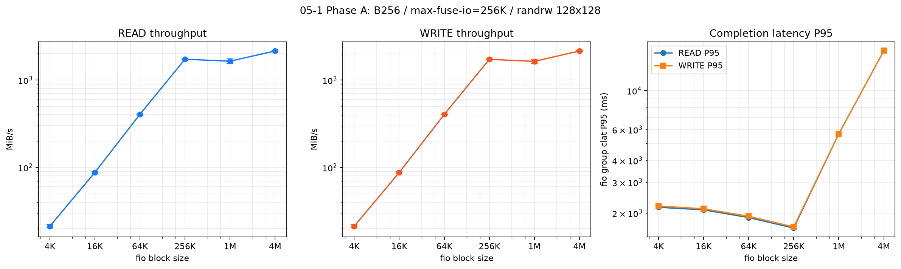

# 05-1报告：randrw不同BS性能曲线与FUSE适配调优

> 日期：2026-09-14
>
> 状态：`VALID / COMPLETED / ENVIRONMENT_CLOSED`
>
> ⚠️ **2026-09-15 订正与使用限制（须先读）**：独立复算已复现本报告全部正式窗数值，非性能门亦通过；
> 但补充两条限制：
> ① **Phase A 无机制证据**——12 个格的 `metrics-pre/post.prom` 均为空
> （`METRICS_MISSING_ALLOWED_PHASE_A`，Phase A 复用未开 metrics 端口的生产挂载 `/mnt/juicefs`），
> 因此 §三 末段"小 I/O 固定开销被摊薄""进入平台区"只能作为**假设**，⛔ 不得当作机制归因；
> 机制结论一律引用 05-1b 的逐秒采样。
> ② **对外可比性按 BS 分级**——只有 256K（同配置离散度 `2.1%`）与 4M 的 FUSE1M 口径（`4.3%`）
> 可与有方做精确百分比对比；4K/16K/64K/1M 的同配置离散度为 `5.5%--61.5%`，只能给区间。
> 且本报告主口径 `[15,175)` 正式窗在小 BS 上比 fio summary 低 `4%--9%`，与有方比对时必须同栏。
> 详见 `doc/perf-report/audit-05-1-05-1b-bs-data-usability-and-comparison-20260915.md` §二/§三/§五。
>
> 任务书：`doc/perf-tasks/05-1-randrw-block-size-sweep-and-adaptive-tuning.md`

## 一、结论

1. 在现有B256卷、无缓存、`128 job × iodepth 128`、50/50 randrw下，应用BS从4 KiB增加到4 MiB时，单方向带宽由约`21 MiB/s`提高到约`2.16 GiB/s`；256 KiB规格点约`1.73 GiB/s`。除1 MiB位置对因漂移超过10%只报范围外，其余档位通过位置漂移门。
2. 对`fio bs=1M`，仅把挂载参数由`--max-fuse-io 256K`改为`1M`，两组READ/WRITE配对均提升，最小效应为`+16.40%`，通过L1材料门。该参数可作为**1 MiB randrw专用挂载候选**，不能替换256 KiB通用基线。
3. 对`fio bs=4M`，相同调整的第一对提升约13%，第二对仅约3%，最小效应`+2.92%`，未通过5%门；停止该方向，不补“漂亮样本”。
4. Phase C的匹配卷BlockSize不执行。现有L1结果已足以登记1 MiB randrw专用FUSE候选；新建fresh B1M/B256卷的成本和变量变化大于当前决策价值。若未来确有稳定的1 MiB生产负载并追求最后增量，可另行重开，且不得与本次FUSE收益合并。

## 二、固定条件与有效性

| 项 | 固定值 |
|---|---|
| JuiceFS | exact patched v1.4.1，MD5 `24fae0852051c80ca571cb2f20275d46` |
| 卷 | 既有`juicefs-prod`，BlockSize=256 KiB |
| fio | `randrw/rwmixread=50/libaio/iodepth=128/numjobs=128/direct=1/runtime=180` |
| 数据 | 既有128个1 GiB `rw_test`文件；不layout、不增删文件 |
| 正式窗 | timed-I/O起点后`[15,175)`，160个1秒样本 |
| 稳态门 | 每cell前执行卷内GC，再等待objects/stored稳定且三节点TiKV pending-compaction连续3点为0 |

有效Phase A RUN为`20260914-124132`，12/12 cell的fio与日志完整，分析错误为空；256 KiB首尾READ/WRITE漂移分别为`-2.10%/-2.11%`。有效Phase B RUN为`20260914-141125`，8/8 cell完整，且冻结并校验了Phase A证据源。

前期两个RUN未进入正式效应：`20260914-112206`因缺少cell间状态回收导致锚点漂移约`-81%`；`20260914-123015`因恢复门错误地要求首个采样点立即为零而在第二格fio前停止。两次问题都在新RUN前修复，失效数据没有混入下表。

## 三、Phase A：当前通用配置的BS曲线

下表为相同BS正反位置点；`均值/范围`均按每格160秒正式窗计算，READ和WRITE分别统计。

| fio BS | READ MiB/s | WRITE MiB/s | 位置漂移READ/WRITE | 裁决 |
|---|---:|---:|---:|---|
| 4K | `22.21 / 20.25`（均值21.23） | `22.22 / 20.25`（均值21.24） | `-8.81% / -8.90%` | PASS |
| 16K | `90.39 / 84.70`（均值87.55） | `90.40 / 84.77`（均值87.59） | `-6.29% / -6.24%` | PASS |
| 64K | `409.59 / 400.29`（均值404.94） | `409.80 / 400.65`（均值405.23） | `-2.27% / -2.23%` | PASS |
| 256K | `1749.77 / 1713.00`（均值1731.39） | `1749.26 / 1712.27`（均值1730.77） | `-2.10% / -2.11%` | PASS/锚 |
| 1M | `1741.57 / 1548.37` | `1739.93 / 1544.96` | `-11.09% / -11.21%` | RANGE_ONLY |
| 4M | `2136.89 / 2166.72`（均值2151.81） | `2145.83 / 2173.17`（均值2159.50） | `+1.40% / +1.27%` | PASS |

曲线表明，增大应用BS显著摊薄了小I/O固定开销，但B256/FUSE256K在1 MiB以上开始进入约`1.5–2.2 GiB/s/方向`的平台区；应用BS继续增大不再按比例换取带宽。

图中误差棒是同一BS的正反位置点；P95从持久归档内每格`cells/<cell>/formal/fio.json`的
`jobs[0].{read,write}.clat_ns.percentile["95.000000"]`独立提取并对位置点取均值，来源不是带宽分析JSON。其值只用于观察随BS变化的端到端趋势。

| fio BS | READ clat P95 ms | WRITE clat P95 ms |
|---|---:|---:|
| 4K | 2160.07 | 2197.82 |
| 16K | 2088.76 | 2118.12 |
| 64K | 1887.44 | 1920.99 |
| 256K | 1644.17 | 1669.33 |
| 1M | 5670.70 | 5670.70 |
| 4M | 16911.43 | 16911.43 |

## 四、Phase B：`--max-fuse-io=1M`筛选

Phase B每个BS的实际执行顺序均为`C1→T1→T2→C2`：

- `C`（Control）表示对照配置，即`--max-fuse-io 256K`；`T`（Treatment）表示待验证配置，即`--max-fuse-io 1M`；
- 数字`1/2`表示该配置在本矩阵中第一次或第二次执行，并非另一套参数；
- `C1→T1`和`C2→T2`分别组成前、后两个位置相邻的对照配对。只有两组配对的READ、WRITE都同向提升，且四个效应中的最小值达到5%，才判定通过。

### 4.1 1 MiB randrw

| 配对 | 方向 | FUSE256K MiB/s | FUSE1M MiB/s | 效应 |
|---|---|---:|---:|---:|
| C1→T1 | READ | 1658.86 | 2058.26 | `+24.08%` |
| C1→T1 | WRITE | 1656.82 | 2056.26 | `+24.11%` |
| C2→T2 | READ | 1691.82 | 1970.37 | `+16.46%` |
| C2→T2 | WRITE | 1689.75 | 1966.85 | `+16.40%` |

四个方向效应最小值`16.40%`，超过5%材料门。FUSE平均读写请求由`256 KiB`准确变为`1024 KiB`；对照GET平均延迟约`13.6 ms`、PUT约`19.8 ms`，测试侧分别约`11.6 ms`和`16.6 ms`。对象GET/PUT的平均数据量仍约为256 KiB，符合B256卷切分边界。结果支持“减少1 MiB应用I/O在FUSE边界的拆分并改善请求调度”的解释，但没有把调度、运行状态和对象层因素完全隔离，不能宣称唯一因果；匹配卷BlockSize的潜在收益也没有计入本次结果。

### 4.2 4 MiB randrw

| 配对 | 方向 | FUSE256K MiB/s | FUSE1M MiB/s | 效应 |
|---|---|---:|---:|---:|
| C1→T1 | READ | 1957.60 | 2216.14 | `+13.21%` |
| C1→T1 | WRITE | 1964.55 | 2221.40 | `+13.07%` |
| C2→T2 | READ | 2242.83 | 2310.66 | `+3.02%` |
| C2→T2 | WRITE | 2248.77 | 2314.53 | `+2.92%` |

第二组对照自身已升至约`2.25 GiB/s/方向`，FUSE1M只剩约3%增益。按预注册规则，该档记`STOP`，不能把第一对的13%单独作为结论。

## 五、生产含义与下一步

- 通用挂载继续使用`--max-fuse-io 256K`。04-8已确认将FUSE1M全局化会使256 KiB randwrite回归，因此本次结果只适用于**已知主要I/O为1 MiB randrw的专用挂载/客户端canary**。
- 若业务确有稳定的1 MiB混合I/O，可先对专用挂载做L2回归；当前L1数据不足以直接修改全局生产配置。
- Phase C经GPT与Luna复核后决定跳过：它不是关闭05-1的必要条件，且需要fresh临时卷、layout和destroy。未来只有在业务明确需要1 MiB专用配置的最后增量时才重开。
- 后续randread/randwrite BS曲线已顺延为**05-3**（2026-09-15新增05-2上传并发/缓冲闸门验证，见05阶段计划书§4.1）；补该曲线时应保持本次状态治理方法，但不应把本次randrw专用结论外推到纯读或纯写。

## 六、环境与证据生命周期

Phase A/B所有任务挂载和任务进程均已退出，157业务服务未变。用户授权后执行最终卷内GC：首轮完成主要压缩和删除后仍有`26,768`个对象差额，且日志存在`stop deleting slice`告警，因此没有提前签闭环；第二轮扫描`1,994,936`个对象并确认全部有效、pending delete为0。

第二轮后三次只读采样完全一致：Ceph对象`1,994,996`、stored `522,928,488,448`字节、三节点TiKV pending-compaction均为0，Ceph为`HEALTH_OK`、6/6 OSD up/in、97 PG active+clean，且无任务挂载/进程。相对任务前稳态，对象差为0、stored仅多`655,360`字节，低于16 MiB门，生命周期正式记为`ENVIRONMENT_CLOSED`。

| RUN | 性质 | 持久证据 | SHA256 |
|---|---|---|---|
| `20260914-124132` | 有效Phase A | `/mnt/c/SunRise/test/05-1/20260914-124132/05-1-20260914-124132-phase-a.tar.gz` | `df81e21b044fa6dc8c342652b1acea51d95c8a6eac1d6aa4301e4ec4fc9755b2` |
| `20260914-140806` | Phase B pre-fio失效，无fio | `/mnt/c/SunRise/test/05-1/20260914-140806/05-1-20260914-140806-invalid-prefio.tar.gz` | `f67ff7a979c41413c3f085b19ff41ee5d1226ad336634705f9125f5758f11200` |
| `20260914-141125` | 有效Phase B及最终恢复 | `/mnt/c/SunRise/test/05-1/20260914-141125/05-1-20260914-141125-phase-b-final.tar.gz` | `07eb203b35089f50a05f3f7cddbe3e6be3683703224e7da775b74fa4c5b154bc` |

旧的Phase B预闭环包保留而不覆盖；带`-final`后缀的新包是本任务最终权威归档。远端原始证据在正式审核前不删除。
