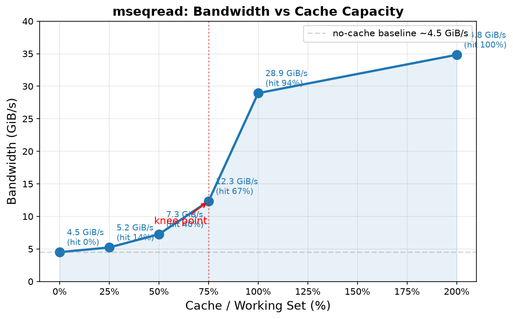
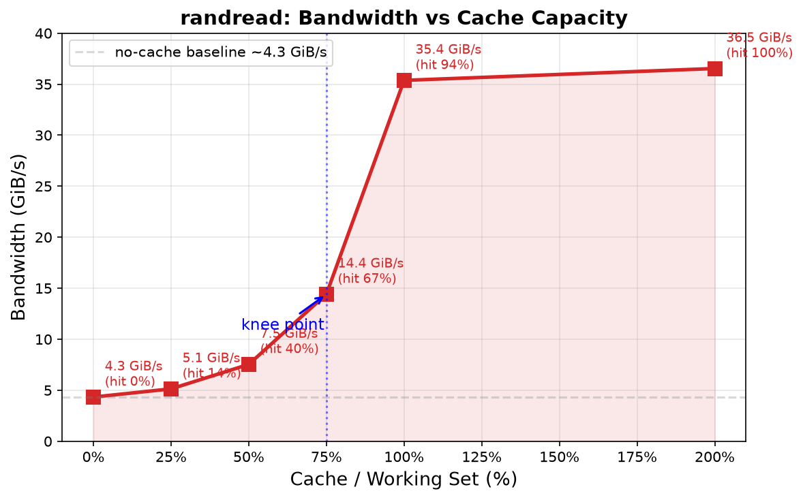

# 周报-JuiceFS调优工作汇总-20260905

> 本周报当前收录：① 七项性能总表（历史演进与当前状态）；② 版本替换判定专题（JuiceFS 1.4.1 能否替代 1.3.1 作为交付基线）。其他工作内容后续补充，格式最后统一调整。

---

# 七项性能总表（历史演进与当前状态）

口径：不限速 100GbE、冷态 cache=0、256K block、单客户端；目标 = 每方向 6250 MiB/s（网卡单向带宽的一半）。单位 MiB/s。

| 测试项 | 方向 | 初始基线（07-14） | 稳定基线（08-06） | 补丁+256K（08-14） | 交付基线 1.3.1（08-21） | **当前版本 1.4.1+补丁（08-31 起）** | 达成率 |
|---|---|---:|---:|---:|---:|---:|---:|
| 顺序读 seqread | 读 | 1272 | 1290 | 1457.5 | 1449 | **1432.9** | 22.9% |
| 多流顺序读 mseqread | 读 | 3330 | 4160 | 3983 | 5366 | **5259.6** | 84.2% |
| 随机读 randread | 读 | 1474 | 1880 | 3831 | 5544 | **5326.1** | 85.2% |
| 混合读写 randrw | 读/写 | 17.9 / 47.5 ⚠失效 | 1215 / 1215 | 1890.5 / 1891.0 | 1870 / 1870 | **1749.3 / 1749.2** | 28.0% |
| 顺序写 seqwrite | 写 | 1346 | 1400 | 1681 | 1570 | **1555.0** | 24.9% |
| 多流顺序写 mseqwrite | 写 | 3891 | 4800 | 4699 | 4676 | **4933.1** | 78.9% |
| 随机写 randwrite | 写 | 3412 | ≈2860 | 3018 | 2707 | **2441.1** | 39.1% |

注：初始基线的 randrw 数值（17.9 / 47.5，标 ⚠失效）因**新卷冷启动失真**不可用于比较——压测落在从未写过的文件上，读侧打空洞、写侧走缓冲，比例与总量均失真（07-16 已定位，同配置正确方法复测真值约 2674 合计），表中保留原值仅供溯源，不参与任何结论。

---
# 版本升级调研

## 一、版本替换判定：问题与候选对象

在同一生产卷、同一挂载参数、同一 Ceph 数据面、同一文件资产上，以 JuiceFS 二进制为唯一变量，判定 patched v1.4.1 能否替代当前交付基座 patched v1.3.1（后者七项基线：seqread 1449 / mseqread 5366 / randread 5544 / randrw 1870 / seqwrite 1570 / mseqwrite 4676 / randwrite 2707 MiB/s）。

前提（此前周报已汇报）：1.4.1 原版存在随机写缺陷（551 MiB/s，约为正常值的 1/5），升级必须携带自研随机写补丁，补丁版恢复至 2700 MiB/s 量级。

## 二、判定方法与七项证据汇总

**方法**：双版本**逐轮交错**测试（ABBA-BAAB 8 轮矩阵，消除时间与集群状态漂移；锁定均值估计量、二次回归建模轮序趋势、每阶段 4 轮预热消化收敛过程、受控暂停后台巡检排除随机干扰），判据为 **5% 关注线 / 10% 材料性退化红线**。判定分两轮执行：首轮筛查 24 个正式轮，其中随机读写混合、随机写两项因测量干扰不可判，经改进设计的补证测试（16 个正式轮）闭合；全部结果经独立复算。

七项最终证据汇总（带宽单位 MiB/s，为两臂各 4 轮正式窗均值；读三项与顺序写取自首轮判定，其余取自补证测试）：

| 测试项 | 1.3.1 带宽 | 1.4.1 带宽 | 版本效应 | 双侧 95% 置信区间 | 结论 |
|---|---:|---:|---:|---|---|
| 顺序读 | 1429.3 | 1432.9 | −0.05% | — | 基本一致 |
| 多流顺序读 | 5258.4 | 5259.6 | +0.57% | — | 基本一致（噪声内） |
| 随机读 | 5308.3 | 5326.1 | +0.58% | — | 基本一致（噪声内） |
| 混合读写（读/写） | 1758.5 / 1758.2 | 1749.3 / 1749.2 | −0.52% / −0.51% | [−5.5%, +4.5%] | 基本一致；首轮遗留风险项已排除 |
| 顺序写 | 1553.9 | 1555.0 | −0.28% | — | 基本一致 |
| 多流顺序写 | 4791.3 | 4933.1 | **+2.96%** | [−3.5%, +9.4%] | **有优化倾向** |
| 随机写 | 2492.9 | 2441.1 | **−2.08%** | [−5.1%, +0.9%] | **有劣化倾向**，但区间跨 0，统计上与无差异不可区分 |

同期确认两项事实：**1.4.1+补丁无随机写崩塌**（绝对值与 1.3.1 同量级）；**元数据格式兼容、回滚可行**（1.4.1 的卷设置仅多一个空默认字段，两版本双向挂载均验证通过）。

## 三、结论

七项均未测到材料性退步：五项基本一致（差距 ±1% 以内），多流顺序写有约 +3% 的优化倾向，随机写有约 −2% 的劣化倾向（置信区间跨 0，统计上不能断言退步真实存在，点估计幅度也远在 5% 关注线以内）。结合元数据格式兼容可回滚、补丁版无随机写崩塌两项事实，**正式裁决已于 08-31 出具：批准替换**——携带自研随机写补丁的 v1.4.1 正式替代 v1.3.1 作为交付基线（社区原版 v1.4.1 维持排除，不得交付），后续实验与交付统一使用该 1.4.1 补丁版二进制。详细判定记录见 `doc/perf-report/u141d-juicefs-v141-replace-v131-final-20260831.md`。

---

# 测试稳定性控制：排除 Ceph scrub 随机干扰

Ceph scrub 是 OSD 周期性读取对象并校验副本或纠删码数据一致性的后台巡检；它不是 PG 故障，但与性能测试并发时会竞争 OSD 读盘和调度资源。U141d 一次未暂停 scrub 的长矩阵在 W02-V14 正式 fio 结束约 `6.5` 分钟后命中 PG `3.d` 的 `11` 秒普通 scrub，虽经时间戳复核未污染正式 I/O 窗，仍暴露出例行巡检会随机打断长矩阵；随后检查过去 `24` 小时日志，共发现至少 `12` 次普通 scrub和 `1` 次 deep-scrub，阶段级命中并非小概率事件。

本周将 `noscrub + nodeep-scrub` 固化为因果调优和版本比较 phase 内的对称环境控制条件，并在 phase 结束后立即恢复。应用后，U141d Phase A 的 `4` 轮预热、`8` 轮正式测试（`24` 个 item）以及 Phase B 的 `2` 轮 canary、`8` 轮正式测试均完整取得有效证据，即合计闭合 `16` 轮正式测试和 `6` 轮预热/canary，避免了例行巡检造成的随机中止及证据作废。

该措施的明确收益是提高长矩阵的环境可控性和有效证据产出率；目前没有执行 scrub 开/关的同口径性能 A/B，因而不能宣称带宽提高或 CV 下降，也不能作为生产性能配置交付。生产环境仍应保持 scrub，以维持长期数据一致性巡检。

---

# randrw 预读参数 A/B 测试（暂存任务 04-tmp）

**目的**：randrw 是生产规格的混合读写模型，当前每向约 1750–1870 MiB/s，距目标 6250 缺口约 3 倍。历史上"关闭预读（`--max-readahead 0`）"能否提升 randrw 的证据互相矛盾——早期 128K FUSE 下曾见 +28%，但该收益经溯源主要来自 FUSE 粒度而非预读本身。本任务在当前最终配置（1.4.1 补丁版 + 256K FUSE + 客户端通信线程 8 + 无缓存）下，用严格 A/B 正式闭合这最后一个有机制依据的挂载变量。

**方法**：单变量 A/B（A=默认预读，B=关闭预读），4 轮预热 + ABBA-BAAB 八轮正式矩阵，每轮独立挂载、冻结随机种子配对；读写分向建模，5% 为预注册的最小材料收益线。

**结果**（2026-09-01，RUN 已闭合，证据状态 VALID）：

| 方向 | 默认预读 MiB/s | 关闭预读 MiB/s | 效应 | 双侧 95% 置信区间 | 结论 |
|---|---:|---:|---:|---|---|
| 读 | 1657.5 | 1684.5 | +1.62% | [+0.04%, +3.21%] | 上界低于 +5%，排除材料收益 |
| 写 | 1658.1 | 1685.4 | +1.64% | [+0.01%, +3.28%] | 上界低于 +5%，排除材料收益 |

四个跨臂对照对两向全部为正（+0.76% / +1.19% / +1.59% / +3.00%），方向一致说明关闭预读确有小幅残余作用，但最大配对仍仅约 3%，达不到 5% 材料线。置信区间半宽仅 1.6pp，远低于 5pp 分辨率门，证据精度充足。

**结论**：不将 `--max-readahead 0` 加入生产交付配置，保持默认预读；关闭当前栈上 randrw 的预读参数方向，不补样、不重跑。即使采用关闭预读，两向也只有约 1685 MiB/s，仅达目标 27%，不改变 randrw 受共享服务容量（约 3.3 GiB/s）约束、距双向目标很远的架构结论。

> 早期 128K FUSE 下见到的 ra0 +28% 主要已被"FUSE 粒度从 128K 提到 256K"消化——该调整当时已让 randrw 两向提高约 53%，因此当前栈下关闭预读只剩约 1.6% 增量。

**其他暂存任务**（同属暂存系列，不占正式阶段编号）：① 本地读缓存稳定收益验证（192 GiB 全暖缓存 vs 无缓存），任务书评审稿、脚本待编写、未授权执行；② 竞品大块单流顺序口径对标，任务书就绪、脚本待编写，在现有 256K 卷上复现竞品公布的四条大块命令（cp 读写约 2 GB/s、fio 单流读约 5.4 GB/s / 写约 3.2 GB/s）并验证有限适配参数，不覆盖主线 256K 七项口径。

---

# randread PG Primary负载均衡验证（04-1b）

**目的与方法**：在同一个64-PG、EC 4+2测试Pool、同一UUID和同一份128×1 GiB只读数据上，仅切换PG Primary分布，验证Primary负载均衡对randread的影响。自然态为`10:15:11:11:8:9`（不均衡度`I_primary=1.40625`），手工均衡态为`10:11:11:10:11:11`（`I_primary=1.03125`）。

| 条件 | 两轮带宽 MiB/s | 均值 MiB/s | 同条件极差 |
|---|---:|---:|---:|
| 自然Primary | 3467 / 3438 | 3452.5 | 0.84% |
| 均衡Primary | 3920 / 3929 | 3924.5 | 0.23% |

**结果**：均衡Primary后randread提高`472 MiB/s`，相对提升**13.67%**，证明严重的Primary分布不均会形成读负载热点，手工均衡是有明确收益的工程方向；但均衡后仍仅达到6250 MiB/s目标的`62.79%`。

**交付判断**：暂不纳入当前生产交付配置。该收益来自特定测试Pool，其自然态比原Pool历史读负载不均衡度`1.132--1.136`更严重，`13.67%`不能直接外推；同时四轮未完全保持同一挂载实例，且无法取得正式窗口内OSD实际`op_r`，因此只签工程信号。现有EC Pool直接使用`pg-upmap`可能触发shard重排和恢复流量；未来从零建集群时，可在空Pool写入数据前预先设置均衡的pool-scoped `pg-upmap`，但需关闭自动balancer后人工维护并在扩容、故障后重算，或升级后采用Primary感知的自动balancer。考虑运维复杂度，当前不采用该优化措施。

---

# 历史TiKV与fresh临时TiKV性能差异归因（04-2）

**目的**：此前将历史TiKV切换为fresh临时TiKV后，randwrite曾出现约`25%～30%`的组合提升，但同时改变了元数据规模、集群起点和底层存储形态。本任务首先拆分存储形态：在相同物理NVMe、相同fresh TiKV和immutable seed下，只比较TiKV直接使用原生ext4（C）与同盘backing file + loop/ext4（L）。

| 对照 | 调整后带宽 MiB/s | 名义差异 | 双侧95%置信区间 |
|---|---:|---:|---:|
| fresh原生ext4（C） | `4121.22` | — | — |
| fresh nested-loop/ext4（L） | `3933.97` | `-4.54%` | `[-12.45%, +3.37%]` |

**结果**：八个C/L正式arm全部通过证据硬门，但同臂噪声达到`8.45%`，当前分辨率不足以确认nested-loop存在稳定的`4.54%`损失；数据也不支持它是此前`25%～30%`组合差的主要来源。历史TiKV前后锚点分别为`4072.58/1417.99 MiB/s`，端点漂移`96.70%`，说明历史环境状态在维护窗口内发生了大幅变化，因此本轮不能固化“fresh TiKV提升25%～30%”，也不能进一步把差异单独归因到RocksDB历史状态或元数据规模。

**工程结论**：04-2没有产生新的生产配置。当前只能确认底层nested-loop不是已证实的主要瓶颈，剩余差异主要待从逻辑元数据规模、region/LSM状态及历史运行状态中继续拆分；若业务仍要求完成来源归因，可由04-3a先验证元数据规模联合效应，再按结果决定是否执行region单因素实验。该归因工作不阻塞04阶段最终调优收尾。

---

# 读缓存容量曲线测试（04-tmp2d）

**目的**：在 JuiceFS 当前交付配置下，测量 mseqread 和 randread 两项读测试的带宽随本地缓存容量占工作集比例的变化关系，量化缓存容量对读带宽的影响。

**方法**：每项 7 个 cell（`A0→C25→C50→C75→C100→C200→A0`），缓存介质为 157 原生 NVMe ext4。工作集：mseqread 64 GiB（16×4G）、randread 128 GiB（128×1G）。每个缓存 cell 预热 180s + 正式 180s，取正式窗 `[15,175)` 均值。A0 前后双锚控制时间漂移。

**结果**（2026-09-03，RUN `20260903-131428`，14/14 cell 有效）：

mseqread（16×4 GiB，psync，64 GiB工作集）—无缓存双锚均值`4620.88 MiB/s`，A0前后漂移`+0.87%`：

| Cell | 缓存占工作集 | MiB/s | GiB/s | 相对A0 | CV | W4/W1 | 命中率 | cache gauge |
|---|---:|---:|---:|---:|---:|---:|---:|---:|
| A0-pre | 0% | 4600.91 | 4.49 | — | 2.13% | 1.0036 | 0% | 0 |
| C25 | 25% | 5357.61 | 5.23 | +15.94% | 2.66% | 0.9697 | 14.37% | 15.97 GiB |
| C50 | 50% | 7436.75 | 7.26 | +60.94% | 4.86% | 0.9793 | 40.32% | 31.85 GiB |
| C75 | 75% | 12633.37 | 12.34 | +173.40% | 7.45% | 1.0021 | 67.30% | 45.66 GiB |
| C100 | 100% | 29636.67 | 28.94 | +541.36% | 7.06% | 0.9996 | 94.40% | 63.80 GiB |
| C200 | 200% | 35664.08 | 34.83 | +671.80% | 1.11% | 0.9996 | 100.00% | 65.00 GiB |
| A0-post | 0% | 4640.85 | 4.53 | — | 1.46% | 1.0083 | 0% | 0 |

randread（128×1 GiB，libaio，128 GiB工作集）—无缓存双锚均值`4434.60 MiB/s`，A0前后漂移`+0.16%`：

| Cell | 缓存占工作集 | MiB/s | GiB/s | 相对A0 | CV | W4/W1 | 命中率 | cache gauge |
|---|---:|---:|---:|---:|---:|---:|---:|---:|
| A0-pre | 0% | 4431.06 | 4.33 | — | 3.87% | 0.9915 | 0% | 0 |
| C25 | 25% | 5257.07 | 5.13 | +18.55% | 5.83% | 0.9938 | 16.27% | 30.46 GiB |
| C50 | 50% | 7712.65 | 7.53 | +73.92% | 4.19% | 1.0041 | 41.72% | 61.27 GiB |
| C75 | 75% | 14764.59 | 14.42 | +232.94% | 5.25% | 1.0582 | 69.76% | 92.50 GiB |
| C100 | 100% | 36220.89 | 35.37 | +716.78% | 1.80% | 1.0063 | 95.35% | 122.71 GiB |
| C200 | 200% | 37411.45 | 36.53 | +743.63% | 1.79% | 0.9912 | 100.00% | 130.00 GiB |
| A0-post | 0% | 4438.13 | 4.33 | — | 3.50% | 1.0149 | 0% | 0 |

- 75%→100% 区间出现明显容量拐点（C75收益已达 +173–233%，随后随命中率接近全满进一步陡升）
- 100% 名义容量命中率仅 94–95%（缓存块/条目开销导致持续淘汰）
- 200% 达到全驻留，Ceph 数据网 RX 趋近于 0，两项分别达 34.8/36.5 GiB/s
- A0 前后漂移 <1%，14 个 cell 全部通过证据硬门

带宽随缓存容量的增长不是线性的：逻辑带宽为`B`、实测命中率为`H`时，只有`B×(1-H)`需要进入Ceph。C25/C50/C75的randread该值分别约`4.30/4.39/4.36 GiB/s`，mseqread分别约`4.48/4.33/4.04 GiB/s`，均接近无缓存锚`4.33/4.51 GiB/s`，说明这些档位的带宽增长主要来自缓存按命中率卸载了固定容量的Ceph慢路径，而不是Ceph本身变快。由此可近似写成`B≈B0/(1-H)`；当C75→C100使miss率从约30%降至约5%后，后端约束迅速退出，带宽转而接近本地缓存、Linux页缓存与NVMe组合路径约35–37 GiB/s的平台。

按相对无缓存锚的累计收益口径，C25只增加`0.72/0.80 GiB/s`，C75则分别增加`7.83/10.09 GiB/s`，两项合计约`17.9 GiB/s`（粗粒度可表述为约`19 GiB/s`）。这体现的是C75相对无缓存的累计收益，不是C50→C75单个区间的增量；该区间实际增加`5.08/6.89 GiB/s`。因此缓存越接近覆盖热集，减少同样比例的miss所释放的逻辑吞吐越大，但不再使用“27倍边际收益”作为严格数学结论。

**工程建议**：

1. 对有独立本地 NVMe 且读热集明确的生产场景，本地读缓存值得进入独立 canary；
2. 容量规划应按"热工作集 + 缓存条目/块开销 + 20% 空闲保护"，不需要机械配到 2 倍；
3. 空间紧张时 50% 档已有 +61–74% 收益，75% 档 +173–233%，可用于成本/收益估算；
4. 不加入无缓存七项交付基线，不据此启用 writeback；
5. 若要固化生产档位，只需小范围补 110%/125% canary 定位最小全驻留余量。

**环境状态**：RUN 缓存目录已清空、无残留进程，Ceph `HEALTH_OK`、97/97 PG active+clean。报告：`doc/perf-report/04-tmp2d-production-aligned-read-cache-curve-20260903.md`。

---

# writeback 16 GiB生命周期与容量下限测试（04-tmp2e）

**目的**：验证 JuiceFS writeback 模式在16 GiB有限本地staging空间下能否稳定排空，并判断是否值得作为生产短突发写的后续canary候选；本轮未形成完整容量曲线。

**方法**：16 GiB ext4 backing（loop + 文件），`--writeback --cache-size 1 --free-space-ratio 0.20`，randwrite 128×1 GiB / 256 KiB / 128 job / 180s。排空门：fio 结束后最长 900s，staging 连续两次归零才算通过。W16 通过后才启动 W32/W64/W96/W128。

**结果**（2026-09-03，RUN `20260903-181523`）：

| 指标 | 结果 |
|---|---:|
| backing 实际可用 | 15.53 GiB |
| staging 峰值 | 15.22 GiB（97.96% 占满） |
| 前台正式窗均值 | 2436.50 MiB/s |
| W1 / W2 / W3 / W4 | 2623 / 2918 / 2580 / 1624 MiB/s |
| 900s 排空终值 | **残留 2 blocks / 524288 B**（未通过） |
| ENOSPC 记录 | ~4156 条 rawstaging + ~135.8 万条直传回退 |

- fio 本身成功（128 job 全部完成，0 errors），前台均值与无缓存基线（~2441 MiB/s）接近
- 前半段均值 ~2771 MiB/s，较历史无缓存代表值高约13.5%，W2达2918 MiB/s；这是非同窗对照的突发增益信号，不登记为严格A/B收益
- W4降至1624 MiB/s，说明staging耗尽后前台进入约1.62 GiB/s的回压平台；该值不是已闭合的远端持久化带宽
- 排空门失败：16 GiB 不足以承接 128-job 持续满压写入，staging 饱和后无法在 900s 内归零
- 按任务书早停，W32/W64/W96/W128 均未启动

**机制归因**：`free-space-ratio=0.20` 的 stage 停止阈值为 `freeRatio/2`（~10%），空间检查按秒更新但 128 job 可在一个间隔内越过阈值触发 ENOSPC；staging 文件 hardlink 到 cache 路径时因 ENOSPC 失败，残留于 rawstaging 形成长期未清文件。

**生产判断**：

1. writeback进入**条件性生产canary候选**：仅在客户端有独立、可靠、充足本地持久空间时小范围验证，不作为默认交付配置
2. 当前只观察到短时突发写的约+13.5%工程信号，不适用于持续满压写入，也不宣称提高Ceph长期服务率
3. 远端持久化完成以 staging 归零为准，不能只以应用 write/close 返回为准
4. 客户端本地盘或整机在排空前损坏仍存在数据风险；跨客户端读取前也必须确认staging归零
5. 容量可按`(突发前台速率－排空能力代理值)×最长突发时间+安全余量`粗估；按本轮W2/W4计算，60秒突发约需99–114 GiB，但W4只是前台回压带宽，不能把该示例当成已验证容量
6. 无缓存配置继续作为通用基线和空间不足时的回退方案

**环境状态**：cache ext4 已卸载、loop 已 detach、backing 文件已删除、无残留进程；`juicefs-data` 对象数由 3553464 回到 seed 1979158；Ceph `HEALTH_OK`、97/97 PG active+clean。报告：`doc/perf-report/04-tmp2e-writeback-capacity-curve-20260903.md`。
