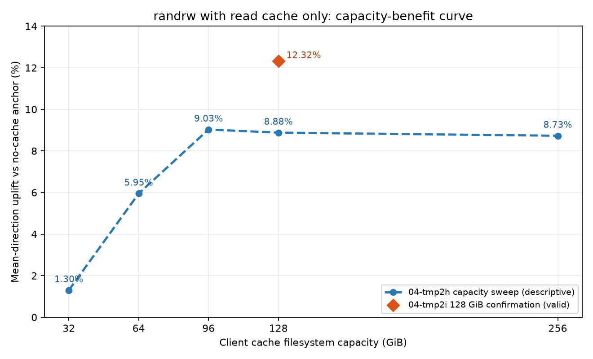

# 周报-JuiceFS调优工作汇总-20260912

## 本周工作总结

本周完成了 H3C 大块单流性能对标与瓶颈全链闭合、randwrite/randrw 缓存收益分析、`--max-fuse-io=1M`正式收益与七项兼容性验证，Weka/有方/BeeGFS 三套竞品同口径七项实测，以及自研 JuiceFS 集群只读管理门户的开发与调试运行。主要结论：`--max-fuse-io=1M`使4 MiB单流seqwrite提升`14.31%`（95% CI `[+13.00%, +15.63%]`），但mseqread未通过非劣确认、randwrite性能劣化，因此不能替换通用`256K`生产基线，仅可作为顺序写专用挂载的灰度候选；Ceph后端聚合能力不是瓶颈（直接RADOS读写均超过H3C披露值），限制在JuiceFS同步单流请求生成路径；异步读（libaio/QD8）可达5278 MiB/s并越过H3C线；writeback对randwrite短时前台有约45%收益，读缓存+writeback同时开启则因竞争导致randrw下降约17%。竞品七项方面，Weka多流和随机负载大幅领先，有方randread最强，BeeGFS顺序单流和随机写有优势。自研管理门户已完成监控页面、认证RBAC和三级目录空间快照（DirStats+SQLite，10万文件查询0.05秒 vs du 22秒）的开发并在152调试运行，低扰动验收确认各节点CPU<1%。

---

## 1、randwrite/randrw 缓存收益分析

针对 randwrite 和 randrw 场景，分析 JuiceFS 缓存策略的实际收益与适用边界。

### 1.1 randwrite：writeback提高短时前台带宽

在`128×1 GiB`文件、`256 KiB`、`128 job`的randwrite负载下，每格固定写入128 GiB，对比不同writeback实际可用空间。下表带宽为fio实际active-I/O阶段的聚合值；约20 GiB为首尾双锚均值。

| writeback实际可用空间 | active-I/O带宽 | 相对约20 GiB锚 | 严格排空时间 |
|---:|---:|---:|---:|
| `19.502 GiB` | `2641.98 MiB/s` | 基线 | `33—89 s` |
| `31.185 GiB` | `3311.08 MiB/s` | `+25.33%` | `75 s` |
| `62.429 GiB` | `3849.15 MiB/s` | `+45.69%` | `264 s` |
| `124.917 GiB` | `3881.53 MiB/s` | `+46.92%` | `239 s` |

约20→64 GiB时，writeback可用空间解除了净脏数据积压对前台的限制，active-I/O带宽提高`45.69%`；64→128 GiB只再提高`0.84%`。实测脏数据峰值约53 GiB，说明前台写入与后台Ceph上传同时进行，64 GiB已基本容纳本负载的最大净积压。图中无缓存`2441.1 MiB/s`为历史参考，与本轮测试不是同窗A/B，不用于计算正式效应量。

writeback改变的是前台返回时间，不是Ceph长期持久化服务率。在另一组180秒持续满压负载中，20/32/64 GiB分别需要`82/100/355 s`排空，128 GiB在`900 s`内仍未排空。因此，writeback适合有持久本地空间、文件由单客户端独占写、且写入突发之间存在足够排空窗口的场景；容量应按"前台速率与后台上传速率的差×最长突发时间+安全余量"规划。

### 1.2 randrw：纯读缓存有条件收益，读写缓存同时开启会产生竞争

在`128 job`、`50/50 randrw`负载下，修复采样干扰后完成了5格有效收尾。无缓存首尾锚的最大漂移为`6.88%`，各缓存格效应均与同位置无缓存插值锚比较。

| 缓存策略 | READ | WRITE | 双方向均值 | 相对无缓存 | 排空 |
|---|---:|---:|---:|---:|---:|
| 只开读缓存（128 GiB） | `1850.50 MiB/s` | `1851.14 MiB/s` | `1850.82 MiB/s` | `+12.32%` | `0 s` |
| 只开writeback | `1706.38 MiB/s` | `1707.12 MiB/s` | `1706.75 MiB/s` | `+5.45%` | `10 s` |
| 读缓存+writeback（25%缓存容量） | `1394.26 MiB/s` | `1393.71 MiB/s` | `1393.98 MiB/s` | `-16.88%` | `57 s` |

#### 1.2.1 只开读缓存时的容量收益曲线

修复此前正式窗递归采样干扰后，在`128 × 1 GiB`既有热集上重测了只开读缓存的
`32/64/96/128/256 GiB`五档randrw。各点带宽来自128份per-job日志的`[15,175)s`完整窗口，
并与同轮相邻无缓存锚插值比较：

| cache-size | 热集占比 | 只开读缓存双方向均值 | 相对无缓存插值锚 | 命中率 |
|---:|---:|---:|---:|---:|
| `32 GiB` | 25% | `1737.29 MiB/s` | `+5.62%` | 11.08% |
| `64 GiB` | 50% | `1678.55 MiB/s` | `+3.95%` | 22.63% |
| `96 GiB` | 75% | `1742.96 MiB/s` | `+9.82%` | 31.55% |
| `128 GiB` | 100% | `1810.11 MiB/s` | `+11.07%` | 38.16% |
| `256 GiB` | 200% | `1829.92 MiB/s` | `+14.84%` | 47.41% |

本轮8个测试点全部通过，无缓存锚漂移`5.03%`、正式采样最大间隔`1.031s`，曲线状态为`VALID`，因此本表
正式替代此前无效的五档观察值。按预注册平台判据，96 GiB相对最佳256 GiB只低约`4.37%`，
更大容量没有超过`5.03%`的可分辨新增收益，因此96 GiB是本次128 GiB热集的最小平台档。
此前独立测得的128 GiB点为`+12.32%`，本轮128 GiB档为`+11.07%`，方向和材料幅度一致。

纯读缓存的收益机制得到旁证：命中率由32 GiB档的`11.08%`升至256 GiB档的`47.41%`，客户端Ceph数据网
RX由无缓存锚约`1910--1975 MiB/s`降至256 GiB档的`1150 MiB/s`。但randrw持续覆盖会使已缓存读块
失效，96/128/256 GiB档的READ `W4/W1`仍分别下降`22.51%/29.06%/29.40%`，所以这些正收益是完整
160秒正式窗均值，不是稳定不衰减的本地缓存速度。当前仅登记96 GiB纯读缓存为生产canary
起点，要求生产canary继续观察长窗口均值和后段衰减，不直接替换无缓存基线。

只开writeback的active-I/O改善`5.45%`，低于此前同条件测得的`6.88%`分辨率；计入10秒排空后
也没有材料级持久带宽收益。

读缓存与writeback共用同一个cache目录，并不是两个固定隔离的容量分区。同时开启时，block cache、
`raw`、`rawstaging`、缓存淘汰和后台上传共同竞争本地空间和I/O；同时开启的格实测命中率约`25.71%`，
但总体带宽反而下降`16.88%`。因此当前不将"读缓存+writeback"作为50/50 randrw的通用配置；读密集业务可单独canary读缓存，低占空比突发写业务可单独canary writeback。

---

## 2、`max-fuse-io=1M`正式收益与生产适用边界

在前期已确认的候选基础上，采用`A-B-B-A`交错配对，正式验证`--max-fuse-io=1M`相对当前`256K`基线的seqwrite收益，并补测其余六项兼容性，判断该参数能否进入统一生产配置。

### 2.1 seqwrite收益得到正式确认

在4 MiB单流seqwrite下，四组固定配对均获得两位数提升：

| 配对 | `256K`基线（MiB/s） | `1M`候选（MiB/s） | 配对效应 |
|---|---:|---:|---:|
| 第一组 | 1896.26 | 2167.76 | `+14.32%` |
| 第二组 | 1893.94 | 2167.10 | `+14.42%` |
| 第三组 | 1923.02 | 2177.67 | `+13.24%` |
| 第四组 | 1898.52 | 2188.15 | `+15.26%` |

配对几何平均效应为`+14.31%`，配对log双侧95% CI为`[+13.00%, +15.63%]`，明显超过`5%`材料阈值；同臂漂移仅`1.27%`。机制证据也一致：FUSE平均写请求由约`256 KiB`增至约`1 MiB`，PUT/OSD完成速率提高约`14.5%`。聚合OSD平均写延迟增加约`8.0%`，未达到预设`10%`材料阈值，但个别配对曾达到`11.02%/13.49%`，应作为生产灰度观察项。

### 2.2 七项兼容性与生产结论

兼容性阶段使用四个独立挂载按`A-B-B-A`执行，其中A为`256K`、B为`1M`。各项目固定配对结果如下：

| 测试项 | 两组B相对A的配对效应 | 判定 |
|---|---:|---|
| seqread | `-0.50% / -0.52%` | 非劣 |
| mseqread | `-6.35% / -2.15%` | 不确定 |
| randread | `-1.71% / -1.05%` | 非劣 |
| mseqwrite | `+1.07% / +0.44%` | 非劣 |
| randwrite | `-21.82% / -2.36%` | 回归门触发 |
| randrw-read | `-0.11% / +5.19%` | 非劣 |
| randrw-write | `-0.15% / +5.16%` | 非劣 |

randwrite四格CV为`16.71%/37.31%/38.85%/36.26%`，因此`-21.82%`不能被解释为稳定、精确的参数因果幅度；但它按预注册规则触发了“任一固定配对低于`-10%`”的回归门，且mseqread也未满足两组均不低于`-5%`的非劣条件，不能为追求seqwrite收益而事后忽略。

最终结论是：保持通用生产基线`--max-fuse-io=256K`不变；`1M`只登记为4 MiB单流顺序写专用挂载的生产灰度候选，适用于可与随机写业务隔离的场景，灰度期间重点监控OSD写延迟和randwrite类业务。正式测试24/24兼容性端点及12/12写后恢复均通过；收尾后Ceph为`HEALTH_OK`、6/6 OSD up/in、97/97 PG active+clean，无任务挂载、进程和私有路径残留。

---

## 3、H3C大块单流性能对比

以H3C公开测试命令为口径，对比 JuiceFS 大块单流读写性能，定位瓶颈并评估方案价值。

### 3.1 同公开测试命令下的性能对比

按H3C公开的前台测试命令和同步单流语义测试，JuiceFS 的 `cp` 单流读写和 fio 同步单流读写四项仍未全面达到H3C公布值。H3C未公开硬件、网络、后端、数据保护及缓存条件，因此这里只说明"在其公开命令口径下未达到其披露值"，不作严格同环境的产品优劣判定。

| 测试项 | H3C披露值 | JuiceFS 当前最佳有效值 | 达成率 |
|---|---:|---:|---:|
| `cp` 20 GiB单流读 | `2.0 GB/s` | `0.996 GB/s` | `49.80%` |
| `cp` 20 GiB单流写 | `2.0 GB/s` | `0.986 GB/s` | `49.30%` |
| fio `bs=20M`同步单流读 | `5.4 GB/s`（`5149.84 MiB/s`） | 无缓存平均`2897.12 MiB/s`；100%热缓存、`max-readahead=32M`平均`3613.61 MiB/s` | `56.26% / 70.17%` |
| fio `bs=16M`同步单流写 | `3.2 GB/s`（`3051.76 MiB/s`） | 无缓存`2616.09 MiB/s`；writeback前台最佳`2866.38 MiB/s` | `85.72% / 93.93%` |

同步单流一次只等待一个应用层请求完成，VFS、FUSE、JuiceFS读写流水线、对象请求及写提交等各层延迟会累加。JuiceFS内部生成的有效在途对象请求又不足以完全隐藏这段延迟，因此带宽受单次完成周期限制。直接RADOS和异步读能够超过H3C线，说明限制不在Ceph总吞吐，而在同步单请求/单文件路径无法充分利用后端并行能力。

缓存只能消除部分后端访问时间，不能消除block-cache索引与拷贝、VFS/FUSE处理和同步等待，也不会自动增加应用层在途请求，所以读数据100%命中后仍存在客户端路径屋顶。writeback则主要把远端持久化延后：前台返回可以变快，但最终还要排空；缓存容量增加只能吸收更多暂存数据，不能提高长期持久化服务率，因此无法形成稳定、可持续的同步单流带宽突破。

### 3.2 Ceph后端读写能力验证

绕过JuiceFS、FUSE和TiKV后直接测试RADOS对象层，结果如下：

| 方向 | 对象大小 | QD | 带宽 | 相对H3C带宽 |
|---|---:|---:|---:|---:|
| 读 | 4 MiB | 8 | `5403.20 MiB/s` | `104.92%` |
| 读 | 4 MiB | 16 | `6659.20 MiB/s` | `129.31%` |
| 写 | 256 KiB | 32 | `3270.74 MiB/s` | `107.18%` |
| 写 | 256 KiB | 128 | **`3948.86 MiB/s`** | **`129.40%`** |

直接RADOS读写均已越过对应H3C线，说明Ceph后端具备所需量级的聚合服务能力，不是当前JuiceFS单流性能的总吞吐瓶颈。写侧QD64→128仍提升`7.90%`，因此本次只确认后端存在余量，尚未测到最终平台；QD32首尾回环仅漂移`+2.24%`，表明这一判断未受明显轮内状态累积影响。

RADOS采用多对象并发，不能把其绝对值等同于JuiceFS单文件同步性能。

### 3.3 异步多请求验证

在单job和原有读写模型不变的条件下，分别验证`async_dio + libaio`及不同QD对大块顺序读写的影响。

| H3C测试项 | H3C披露值 | JuiceFS同命令/同步最佳 | 针对性异步结果 | 相对H3C带宽 |
|---|---:|---:|---:|---:|
| `cp` 20 GiB单流读 | `2.0 GB/s` | `0.996 GB/s` | 无对应异步口径 | 不适用 |
| `cp` 20 GiB单流写 | `2.0 GB/s` | `0.986 GB/s` | 无对应异步口径 | 不适用 |
| fio `bs=20M`单job读 | `5149.84 MiB/s` | 热缓存`max-readahead=32M`：`3613.61 MiB/s` | 4 MiB BlockSize、`max-readahead=32M`、`max-fuse-io=1M`、`cache=0`、`async_dio+libaio/QD8`：**`5277.79 MiB/s`** | **`102.48%`** |
| fio `bs=16M`单job写 | `3051.76 MiB/s` | writeback前台最佳：`2866.38 MiB/s` | libaio最佳QD1：`1349.73 MiB/s`；QD8约`958—997 MiB/s` | `44.23%` |

读操作中，多个在途请求可以重叠VFS、FUSE、JuiceFS客户端、网络和Ceph对象读取的等待时间。`libaio/QD1→2→4→8`时，读带宽由`1975.30`提高到`5277.79 MiB/s`，GET在途量由`4.32`提高到`15.07`，表明并发请求通过流水线重叠隐藏了单请求的固定延迟，并释放了Ceph后端读取余量。

写操作中，一个16 MiB同步写在JuiceFS内部已会拆成多个对象请求并行上传；继续增加同一文件的应用QD，主要增加了文件内写入协调、缓冲/上传队列和提交等待，没有等比例增加后端有效并发。实测QD从1增加到8时，完成延迟由约`10.15 ms`增至约`120 ms`，带宽反而由`1349.73`降至`958—997 MiB/s`。直接RADOS并发写可达`3271—3949 MiB/s`，说明此现象不是Ceph总写带宽不足，而是当前JuiceFS单文件异步写流水线未能将更高应用QD转化为有效对象并发。

### 3.4 方案价值与总体结论

#### 3.4.1 同步单流为什么落后

同步单流每次只有一个应用请求在途，其完成时间包含VFS、FUSE、JuiceFS客户端、网络、对象请求及写提交等多层开销。这些固定延迟在同步模式下串行累加，且不能靠增大单次I/O完全消除，因此单流带宽低于Ceph后端的聚合服务能力。多流或异步读可以用其他请求填补等待窗口；单文件异步写则受文件内协调和提交流水线限制，未获得相同收益。

#### 3.4.2 缓存价值

读缓存的主要价值是将可重用热数据的访问从远端Ceph转化为客户端本地NVMe读取。当热数据集能被完整容纳时，已测得多流顺序读和随机读约`34.83/36.53 GiB/s`，相对同窗口无缓存约提升`671.8%/743.6%`。writeback则可以用本地空间吸收短时写入峰值，已测得特定短时写模型的前台带宽提升约`46%`。

读缓存收益取决于热数据占比；writeback收益取决于突发量、缓存容量和后台排空能力，不应把前台加速等同于长期持久化带宽提升。

#### 3.4.3 总体结论

JuiceFS的价值不应只用同步单流峰值衡量。当负载具备多文件并发、异步读或可缓存热数据时，方案可以更充分地利用Ceph的聚合带宽和客户端本地介质；同时提供POSIX文件语义、共享命名空间、多客户端访问以及元数据与对象数据分离等能力。当前优化重点是根据业务I/O模型选择并发度和缓存策略，而不是将同步单流结果外推为整体方案能力。

---

## 4、Weka 同口径七项实测

在已部署的Weka挂载目录上执行与JuiceFS `FULLBASELINE_V4`同口径的七项脚本：每项运行`180 s`、重复3轮；单流顺序文件为`32 GiB`，16流顺序测试为每job `4 GiB`，随机测试为`128 × 1 GiB`、`256 KiB`、`libaio/iodepth=128`。测试未执行全局`drop_caches`。

| 测试项 | Weka三轮结果 | Weka三轮均值 | JuiceFS无缓存交付口径代表值 | 无缓存/Weka | JuiceFS缓存实验最佳值 | 缓存最佳/Weka |
|---|---:|---:|---:|---:|---:|---:|
| seqread | `1058/1068/1064 MiB/s` | `1063.33 MiB/s` | `1432.9 MiB/s` | `134.76%` | 未按七项口径测试 | — |
| mseqread | `13.7/13.7/13.8 GiB/s` | `13.73 GiB/s` | `5259.6 MiB/s` | `37.40%` | 不纳入对比 | — |
| randread | `19.0/19.1/19.0 GiB/s` | `19.03 GiB/s` | `5326.1 MiB/s` | `27.33%` | `37411.45 MiB/s` | `191.95%` |
| randrw读 | `17.5/17.3/17.3 GiB/s` | `17.37 GiB/s` | `1749.3 MiB/s` | `9.84%` | `1850.50 MiB/s` | `10.41%` |
| randrw写 | `17.5/17.3/17.3 GiB/s` | `17.37 GiB/s` | `1749.2 MiB/s` | `9.84%` | `1851.14 MiB/s` | `10.41%` |
| seqwrite | `1316/1319/1320 MiB/s` | `1318.33 MiB/s` | `1555.0 MiB/s` | `117.95%` | 未按七项口径测试 | — |
| mseqwrite | `16.1/16.1/16.1 GiB/s` | `16.10 GiB/s` | `4933.1 MiB/s` | `29.92%` | 未按七项口径测试 | — |
| randwrite | `21.9/22.0/22.0 GiB/s` | `21.97 GiB/s` | `2441.1 MiB/s` | `10.85%` | `3881.53 MiB/s` | `17.26%` |

Weka七项三轮结果高度集中：顺序单流读写分别约`1.04/1.29 GiB/s`，低于JuiceFS当前无缓存交付口径；多流和随机负载则明显高于JuiceFS，其中randrw读写各约`17.37 GiB/s`（两方向合计约`34.73 GiB/s`）。JuiceFS热数据完整驻留本地缓存后，randread可达到Weka的`191.95%`；缓存对randrw的帮助有限，writeback对randwrite虽有短时前台收益，但仍只达到Weka的`17.26%`。

缓存列采用对应IO模型已有实验中的最佳有效值：randread为完整预热、100%命中的读缓存结果，randrw为纯读缓存结果，randwrite为writeback active-I/O前台结果。预热后完整命中的mseqread不纳入Weka对比。randrw取数窗、randwrite固定写入量与Weka七项脚本的完整180秒fio汇总并不完全相同，因此用于展示缓存能力边界，不作为严格同窗效应量。Weka侧目前也只有fio结果，尚未记录其内部缓存命中、后端流量及两套方案的硬件/数据保护条件，不能据此把差距单独归因于某个组件。

---

## 5、有方同口径七项实测

在有方挂载目录上执行同一七项脚本，三轮结果及与JuiceFS现有数据的对比如下：

| 测试项 | 有方三轮结果 | 有方三轮均值 | JuiceFS无缓存交付口径代表值 | 无缓存/有方 | JuiceFS缓存实验最佳值 | 缓存最佳/有方 |
|---|---:|---:|---:|---:|---:|---:|
| seqread | `438/458/459 MiB/s` | `451.67 MiB/s` | `1432.9 MiB/s` | `317.25%` | 未按七项口径测试 | — |
| mseqread | `7237/7109/6647 MiB/s` | `6997.67 MiB/s` | `5259.6 MiB/s` | `75.16%` | 不纳入对比 | — |
| randread | `28.2/28.6/28.2 GiB/s` | `28.33 GiB/s` | `5326.1 MiB/s` | `18.36%` | `37411.45 MiB/s` | `128.95%` |
| randrw读 | `2663/2177/2175 MiB/s` | `2338.33 MiB/s` | `1749.3 MiB/s` | `74.81%` | `1850.50 MiB/s` | `79.14%` |
| randrw写 | `2665/2177/2175 MiB/s` | `2339.00 MiB/s` | `1749.2 MiB/s` | `74.78%` | `1851.14 MiB/s` | `79.14%` |
| seqwrite | `1365/1482/1344 MiB/s` | `1397.00 MiB/s` | `1555.0 MiB/s` | `111.31%` | 未按七项口径测试 | — |
| mseqwrite | `13.1/12.4/13.2 GiB/s` | `12.90 GiB/s` | `4933.1 MiB/s` | `37.34%` | 未按七项口径测试 | — |
| randwrite | `3251/2443/2538 MiB/s` | `2744.00 MiB/s` | `2441.1 MiB/s` | `88.96%` | `3881.53 MiB/s` | `141.46%` |

有方的randread和mseqwrite聚合吞吐较高；JuiceFS无缓存的seqread、seqwrite更高，热读缓存下randread也高于有方。randrw和randwrite则不能只看三轮均值：randrw从R1到R3下降`18.33%`，randwrite从`3251`降至`2443/2538 MiB/s`，表现出明显的轮次状态变化；mseqread从R1到R3也下降`8.15%`。因此表中均值用于记录本次观测，涉及这些项目的稳定性能结论应以补充状态监控或独立复测为准。

与Weka相同，本次有方材料只有fio摘要，没有内部缓存、后端流量、硬件及数据保护条件；JuiceFS缓存列也沿用对应IO模型的既有能力边界，并非与有方严格同窗A/B。

---

## 6、BeeGFS与Weka、有方的七项数据对比

BeeGFS现有七项测试采用相同测试项定义，以下统一换算为`MiB/s`；`randrw`仍按读、写方向分别比较，不能相加验收。BeeGFS的randread只提供`9252--10752 MiB/s`区间，因此相对值也保留为区间。

### 6.1 BeeGFS与Weka对比

| 测试项 | BeeGFS | Weka三轮均值 | BeeGFS/Weka |
|---|---:|---:|---:|
| seqread | `1516 MiB/s` | `1063.33 MiB/s` | `142.57%` |
| mseqread | `7112 MiB/s` | `13.73 GiB/s` | `50.57%` |
| randread | `9252--10752 MiB/s` | `19.03 GiB/s` | `47.47%--55.17%` |
| randrw读 | `4645 MiB/s` | `17.37 GiB/s` | `26.12%` |
| randrw写 | `4641 MiB/s` | `17.37 GiB/s` | `26.10%` |
| seqwrite | `840 MiB/s` | `1318.33 MiB/s` | `63.72%` |
| mseqwrite | `7731 MiB/s` | `16.10 GiB/s` | `46.89%` |
| randwrite | `6146 MiB/s` | `21.97 GiB/s` | `27.32%` |

BeeGFS仅seqread高于Weka，约为Weka的`142.57%`；其余六项均低于Weka，其中高并发随机读写约为Weka的`26%--55%`。

### 6.2 BeeGFS与有方对比

| 测试项 | BeeGFS | 有方三轮均值 | BeeGFS/有方 |
|---|---:|---:|---:|
| seqread | `1516 MiB/s` | `451.67 MiB/s` | `335.65%` |
| mseqread | `7112 MiB/s` | `6997.67 MiB/s` | `101.63%` |
| randread | `9252--10752 MiB/s` | `28.33 GiB/s` | `31.89%--37.06%` |
| randrw读 | `4645 MiB/s` | `2338.33 MiB/s` | `198.65%` |
| randrw写 | `4641 MiB/s` | `2339.00 MiB/s` | `198.42%` |
| seqwrite | `840 MiB/s` | `1397.00 MiB/s` | `60.13%` |
| mseqwrite | `7731 MiB/s` | `12.90 GiB/s` | `58.53%` |
| randwrite | `6146 MiB/s` | `2744.00 MiB/s` | `223.98%` |

BeeGFS的seqread、mseqread、randrw和randwrite高于有方，其中randrw约为有方的`1.98倍`、randwrite约为`2.24倍`；有方的seqwrite、mseqwrite和randread更高。由于有方的randrw/randwrite存在明显轮次衰减，这里的对比使用其三轮观测均值，不能替代稳定同窗A/B结论。

三套竞品数据来自不同部署环境，当前没有统一的硬件、网络、缓存、数据保护和后端监控证据；上述两个表只用于展示相同七项脚本口径下的观测差异，不将差异归因于文件系统软件本身。

---

## 7、157本地NVMe/ext4能力对照

为区分JuiceFS软件路径限制与单盘介质能力，在157的`/dev/nvme1n1`既有ext4文件系统上，以独立目录执行同口径七项测试。测试使用普通文件，不直接读写裸设备；每项运行`180 s`、重复3轮，参数与前述七项脚本一致。测试完成后已删除约576 GiB测试数据，原始结果持久化在`/mnt/c/SunRise/test/nvme1n1-local-7item/20260910-1125/fio-7item-local-nvme1n1-20260910-1125.tar.gz`，SHA256为`414326cb261543d21263d96cef03522e8cf82f3d3f1be011dada92852fbfa507`。

### 7.1 厂商公开规格

系统识别型号为`Dell DC NVMe CD8 U.2 960GB`，对应Dell OEM版KIOXIA CD8-R 960GB读密集型数据中心SSD。厂商公开规格如下：

| 项目 | 厂商规格 |
|---|---:|
| 接口 | PCIe 4.0 x4，NVMe 1.4 |
| 顺序读 | 最高`7200 MB/s` |
| 顺序写 | 最高`1800 MB/s` |
| 4 KiB随机读 | 最高`1000K IOPS` |
| 4 KiB随机写 | 最高`80K IOPS` |
| 耐久度 | `1 DWPD`，5年 |

官方资料：[KIOXIA Dell OEM CD8规格页](https://americas.kioxia.com/en-us/business/ssd/oem/dell/cd8-data-center-nvme.html)、[KIOXIA CD8-R产品手册](https://www.kioxia.com/content/dam/kioxia/shared/business/ssd/data-center-ssd/asset/productbrief/dSSD-CD8-R-U2-product-brief.pdf)、[Dell CD8 U.2固件支持页](https://www.dell.com/support/home/en-us/drivers/driversdetails?driverid=0g35r)。厂商使用十进制`MB/s`，而fio输出为二进制`MiB/s`，下表保持fio原始单位进行方案对比。

### 7.2 本地NVMe与JuiceFS七项对比

| 测试项 | 本地NVMe/ext4三轮结果 | 本地三轮均值 | JuiceFS无缓存交付口径代表值 | JuiceFS/本地NVMe |
|---|---:|---:|---:|---:|
| seqread | `1977/1970/1970 MiB/s` | `1972.33 MiB/s` | `1432.9 MiB/s` | `72.65%` |
| mseqread | `5849/5850/5849 MiB/s` | `5849.33 MiB/s` | `5259.6 MiB/s` | `89.92%` |
| randread | `5714/5715/5714 MiB/s` | `5714.33 MiB/s` | `5326.1 MiB/s` | `93.21%` |
| randrw读 | `907/989/1005 MiB/s` | `967.00 MiB/s` | `1749.3 MiB/s` | `180.90%` |
| randrw写 | `906/988/1004 MiB/s` | `966.00 MiB/s` | `1749.2 MiB/s` | `181.08%` |
| seqwrite | `1697/1738/1733 MiB/s` | `1722.67 MiB/s` | `1555.0 MiB/s` | `90.27%` |
| mseqwrite | `1694/1729/1739 MiB/s` | `1720.67 MiB/s` | `4933.1 MiB/s` | `286.70%` |
| randwrite | `1408/1544/1530 MiB/s` | `1494.00 MiB/s` | `2441.1 MiB/s` | `163.39%` |

本地seqwrite/mseqwrite均值换算后约为`1805--1806 MB/s`，已达到厂商`1800 MB/s`顺序写规格，说明此前看似偏低的写带宽实际是这块960GB读密集型盘的单盘硬上限。mseqread约为`6133 MB/s`，达到厂商顺序读峰值的`85.2%`；randread约为`5992 MB/s`，也证明NVMe、PCIe链路和ext4能够提供约6 GB/s读带宽。单流seqread只有约`2068 MB/s`，主要因为`psync/iodepth=1/256 KiB`任一时刻只有一个请求，固定完成延迟限制了单流带宽，并非盘只能读取2 GB/s。

JuiceFS无缓存mseqread/randread分别达到单盘本地值的`89.92%/93.21%`；mseqwrite、randwrite和randrw每个方向则分别达到单盘的`286.70%`、`163.39%`和约`181%`。这说明JuiceFS写侧虽然存在客户端和分布式路径开销，但多流与随机负载可以利用多块Ceph OSD的聚合能力，吞吐可明显超过单块960GB CD8-R；单块本地NVMe不能作为分布式后端所有测试项的绝对性能上界。

---

## 8、JuiceFS集群只读管理门户

自研 JuiceFS 集群只读管理门户（Go 标准库后端 + 原生 JS 前端，无框架依赖），部署在 10.20.1.152，将 JuiceFS、TiKV/PD、Ceph、主机和 NVMe 的实时指标统一汇聚到一个 Web 界面中。

### 8.1 架构与功能

门户由三个自研组件和两个开源组件组成：

- **Portal API**（Go 标准库）：提供 12 个只读 REST 接口，支持 GET/HEAD 和登录/退出会话；后端直接查询 Prometheus 和 SQLite，页面刷新不触发 SSH、sudo 或集群命令；
- **Portal Web**（原生 JS/HTML/CSS）：无构建依赖的管理员页面，包含总览、集群拓扑、节点与磁盘、JuiceFS 客户端、TiKV/PD、Ceph、容量和告警八个只读页面；拓扑可动态识别 PD Leader、MGR Active、TiKV Store 和 OSD 状态；
- **目录用量采集器**（Go）：通过 152 专用只读 JuiceFS 挂载，后台调用 DirStats 每 60 秒生成三级目录递归用量快照，写入 SQLite；页面只查 SQLite，不执行实时 `du`。设计思路是利用 JuiceFS 内置的 DirStats 元数据计数（在 TiKV 中维护目录级递归统计值），由后台采集器定期调用 `juicefs summary --depth 3` 获取快照并写入本地 SQLite，页面请求只以 query-only 模式读取 SQLite。这样将"页面查询"和"目录遍历"解耦：前者是毫秒级本地数据库查询，后者是后台低频任务。采集失败时保留上一次成功快照并标记 stale，不向用户呈现空数据。与直接使用 `du` 的效果对比如下：

| 文件规模 | DirStats fast | DirStats strict | du |
|---:|---:|---:|---:|
| 1 万文件 | ~0.05 秒 | ~0.09 秒 | ~0.80 秒 |
| 10 万文件 | ~0.05 秒 | ~0.18 秒 | ~22 秒 |

`du` 需要逐文件 `stat()` 走 FUSE → JuiceFS → TiKV 元数据链路，耗时随文件数线性增长；DirStats 直接读元数据层的聚合计数，查询时间基本恒定。10 万文件时两者差距已达 440 倍，且 `du` 会在页面请求期间阻塞 FUSE 并占用客户端资源，DirStats 快照查询则对业务完全无感知。
- **Prometheus 3.13.2 + Grafana 13.2.1**：作为门户内部数据源和图表能力，不直接暴露给用户；

### 8.2 已完成

- 在 152 以 cgroup 受限方式部署全部服务；
- 接入全部指标源：JuiceFS 客户端（157 轻量转发器）、PD/TiKV（三节点）、Ceph mgr Prometheus 模块、三节点 Node Exporter 和 NVMe 健康采集器；
- 管理员八个只读页面已切换到 Prometheus 实时数据源；
- 完成本地账户认证、HTTPS 和 ADMIN/USER RBAC；
- **三级目录空间快照已完成**：DirStats 后台采集器已接入业务卷，每 60 秒生成三级目录递归用量快照写入 SQLite，页面只查 SQLite 不执行实时 `du`；10 万文件 fast 查询约 0.05 秒，`du` 约需 22 秒。

**当前受限于社区版的功能限制，对于一个目录下有超过100个子目录或者文件的情况，最多只能统计100个子项的具体情况（总量统计正常）。JuiceFS商业版可以直接通过 ls -lh 获取所有文件信息**
