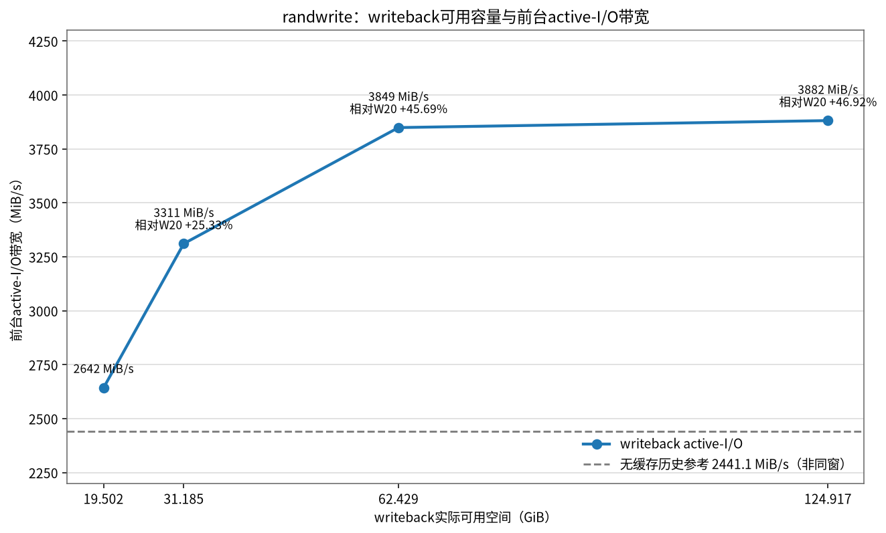
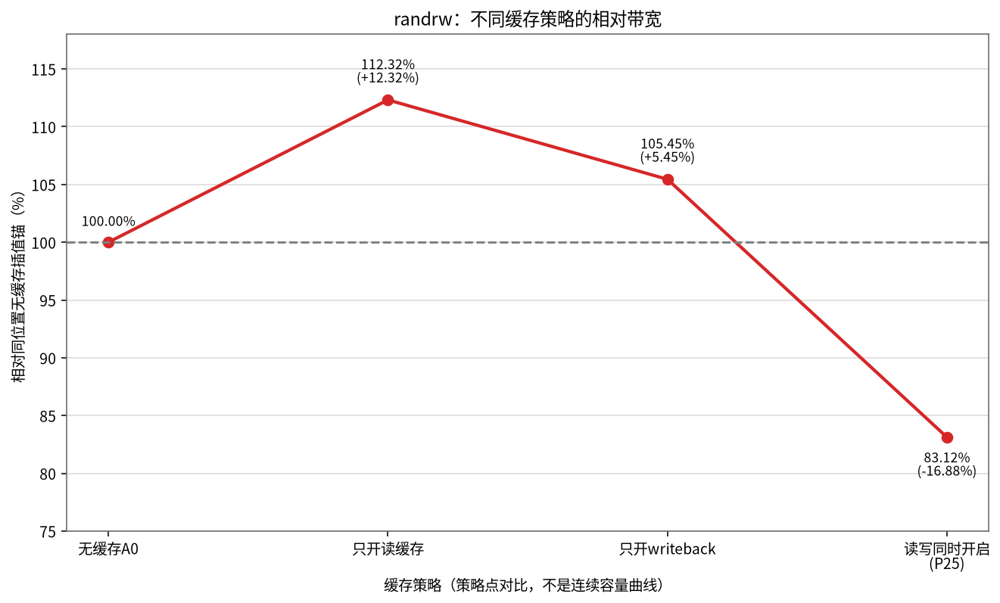
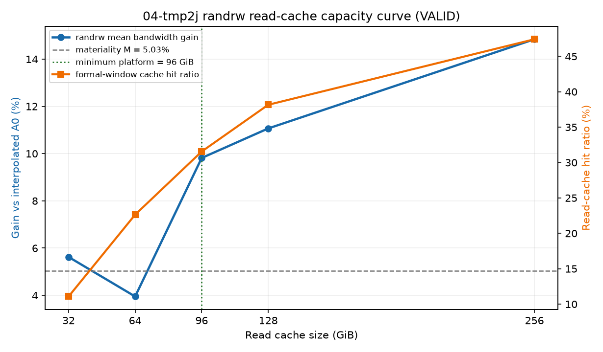

# JuiceFS 04-tmp3 竞品大块单流性能分析及缓存收益评估

---

# 第一部分：竞品大块单流性能对比

以竞品公开测试命令为口径，对比 JuiceFS 大块单流读写性能，定位瓶颈并评估方案价值。

## 一、同公开测试命令下的性能对比

按竞品公开的前台测试命令和同步单流语义测试，JuiceFS 的 `cp` 单流读写和 fio 同步单流读写四项仍未全面达到竞品公布值。竞品未公开硬件、网络、后端、数据保护及缓存条件，因此这里只说明"在其公开命令口径下未达到其披露值"，不作严格同环境的产品优劣判定。

| 测试项 | 竞品披露值 | JuiceFS 当前最佳有效值 | 达成率 |
|---|---:|---:|---:|
| `cp` 20 GiB单流读 | `2.0 GB/s` | `0.996 GB/s` | `49.80%` |
| `cp` 20 GiB单流写 | `2.0 GB/s` | `0.986 GB/s` | `49.30%` |
| fio `bs=20M`同步单流读 | `5.4 GB/s`（`5149.84 MiB/s`） | 无缓存平均`2897.12 MiB/s`；100%热缓存、RA32平均`3613.61 MiB/s` | `56.26% / 70.17%` |
| fio `bs=16M`同步单流写 | `3.2 GB/s`（`3051.76 MiB/s`） | 无缓存`2616.09 MiB/s`；writeback前台最佳`2866.38 MiB/s` | `85.72% / 93.93%` |

同步单流一次只等待一个应用层请求完成，VFS、FUSE、JuiceFS读写流水线、对象请求及写提交等各层延迟会累加。JuiceFS内部生成的有效在途对象请求又不足以完全隐藏这段延迟，因此带宽受单次完成周期限制。直接RADOS和异步读能够超过竞品线，说明限制不在Ceph总吞吐，而在同步单请求/单文件路径无法充分利用后端并行能力。

缓存只能消除部分后端访问时间，不能消除block-cache索引与拷贝、VFS/FUSE处理和同步等待，也不会自动增加应用层在途请求，所以读数据100%命中后仍存在客户端路径屋顶。writeback则主要把远端持久化延后：前台返回可以变快，但最终还要排空；缓存容量增加只能吸收更多暂存数据，不能提高长期持久化服务率，因此无法形成稳定、可持续的同步单流带宽突破。

## 二、Ceph后端读写能力验证

绕过JuiceFS、FUSE和TiKV后直接测试RADOS对象层，结果如下：

| 方向 | 对象大小 | QD | 带宽 | 相对竞品带宽 |
|---|---:|---:|---:|---:|
| 读 | 4 MiB | 8 | `5403.20 MiB/s` | `104.92%` |
| 读 | 4 MiB | 16 | `6659.20 MiB/s` | `129.31%` |
| 写 | 256 KiB | 32 | `3270.74 MiB/s` | `107.18%` |
| 写 | 256 KiB | 128 | **`3948.86 MiB/s`** | **`129.40%`** |

直接RADOS读写均已越过对应竞品线，说明Ceph后端具备所需量级的聚合服务能力，不是当前JuiceFS单流性能的总吞吐瓶颈。写侧QD64→128仍提升`7.90%`，因此本次只确认后端存在余量，尚未测到最终平台；QD32首尾回环仅漂移`+2.24%`，表明这一判断未受明显轮内状态累积影响。

RADOS采用多对象并发，不能把其绝对值等同于JuiceFS单文件同步性能。

## 三、异步多请求验证

在单job和原有读写模型不变的条件下，分别验证`async_dio + libaio`及不同QD对大块顺序读写的影响。

| 竞品测试项 | 竞品披露值 | JuiceFS同命令/同步最佳 | 针对性异步结果 | 相对竞品带宽 |
|---|---:|---:|---:|---:|
| `cp` 20 GiB单流读 | `2.0 GB/s` | `0.996 GB/s` | 无对应异步口径 | 不适用 |
| `cp` 20 GiB单流写 | `2.0 GB/s` | `0.986 GB/s` | 无对应异步口径 | 不适用 |
| fio `bs=20M`单job读 | `5149.84 MiB/s` | 热缓存RA32：`3613.61 MiB/s` | patched 1.4.1、B4、RA32、`max-fuse-io=1M`、`cache=0`、`async_dio+libaio/QD8`：**`5277.79 MiB/s`** | **`102.48%`** |
| fio `bs=16M`单job写 | `3051.76 MiB/s` | writeback前台最佳：`2866.38 MiB/s` | libaio最佳QD1：`1349.73 MiB/s`；QD8约`958—997 MiB/s` | `44.23%` |

读操作中，多个在途请求可以重叠VFS、FUSE、JuiceFS客户端、网络和Ceph对象读取的等待时间。`libaio/QD1→2→4→8`时，读带宽由`1975.30`提高到`5277.79 MiB/s`，GET在途量由`4.32`提高到`15.07`，表明并发请求通过流水线重叠隐藏了单请求的固定延迟，并释放了Ceph后端读取余量。

写操作中，一个16 MiB同步写在JuiceFS内部已会拆成多个对象请求并行上传；继续增加同一文件的应用QD，主要增加了文件内写入协调、缓冲/上传队列和提交等待，没有等比例增加后端有效并发。实测QD从1增加到8时，完成延迟由约`10.15 ms`增至约`120 ms`，带宽反而由`1349.73`降至`958—997 MiB/s`。直接RADOS并发写可达`3271—3949 MiB/s`，说明此现象不是Ceph总写带宽不足，而是当前JuiceFS单文件异步写流水线未能将更高应用QD转化为有效对象并发。

## 四、方案价值与总体结论

### 1. 同步单流为什么落后

同步单流每次只有一个应用请求在途，其完成时间包含VFS、FUSE、JuiceFS客户端、网络、对象请求及写提交等多层开销。这些固定延迟在同步模式下串行累加，且不能靠增大单次I/O完全消除，因此单流带宽低于Ceph后端的聚合服务能力。多流或异步读可以用其他请求填补等待窗口；单文件异步写则受文件内协调和提交流水线限制，未获得相同收益。

### 2. 缓存价值

读缓存的主要价值是将可重用热数据的访问从远端Ceph转化为客户端本地NVMe读取。当热数据集能被完整容纳时，已测得多流顺序读和随机读约`34.83/36.53 GiB/s`，相对同窗口无缓存约提升`671.8%/743.6%`。writeback则可以用本地空间吸收短时写入峰值，已测得特定短时写模型的前台带宽提升约`46%`。

读缓存收益取决于热数据占比；writeback收益取决于突发量、缓存容量和后台排空能力，不应把前台加速等同于长期持久化带宽提升。

### 3. 总体结论

JuiceFS的价值不应只用同步单流峰值衡量。当负载具备多文件并发、异步读或可缓存热数据时，方案可以更充分地利用Ceph的聚合带宽和客户端本地介质；同时提供POSIX文件语义、共享命名空间、多客户端访问以及元数据与对象数据分离等能力。当前优化重点是根据业务I/O模型选择并发度和缓存策略，而不是将同步单流结果外推为整体方案能力。

---

# 第二部分：randwrite/randrw 缓存收益分析

针对 randwrite 和 randrw 场景，分析 JuiceFS 缓存策略的实际收益与适用边界。

## 一、randwrite：writeback提高短时前台带宽

在`128×1 GiB`文件、`256 KiB`、`128 job`的randwrite负载下，每格固定写入128 GiB，对比不同writeback实际可用空间。下表带宽为fio实际active-I/O阶段的聚合值；约20 GiB为首尾双锚均值。

| writeback实际可用空间 | active-I/O带宽 | 相对约20 GiB锚 | 严格排空时间 |
|---:|---:|---:|---:|
| `19.502 GiB` | `2641.98 MiB/s` | 基线 | `33—89 s` |
| `31.185 GiB` | `3311.08 MiB/s` | `+25.33%` | `75 s` |
| `62.429 GiB` | `3849.15 MiB/s` | `+45.69%` | `264 s` |
| `124.917 GiB` | `3881.53 MiB/s` | `+46.92%` | `239 s` |

约20→64 GiB时，writeback可用空间解除了净脏数据积压对前台的限制，active-I/O带宽提高`45.69%`；64→128 GiB只再提高`0.84%`。实测脏数据峰值约53 GiB，说明前台写入与后台Ceph上传同时进行，64 GiB已基本容纳本负载的最大净积压。图中无缓存`2441.1 MiB/s`为历史参考，与本RUN不是同窗A/B，不用于计算正式效应量。

writeback改变的是前台返回时间，不是Ceph长期持久化服务率。在另一组180秒持续满压负载中，20/32/64 GiB分别需要`82/100/355 s`排空，128 GiB在`900 s`内仍未排空。因此，writeback适合有持久本地空间、文件由单客户端独占写、且写入突发之间存在足够排空窗口的场景；容量应按"前台速率与后台上传速率的差×最长突发时间+安全余量"规划。

## 二、randrw：纯读缓存有条件收益，读写缓存同时开启会产生竞争

在`128 job`、`50/50 randrw`负载下，修复采样干扰后完成了5格有效收尾。无缓存首尾锚的最大漂移为`6.88%`，各缓存格效应均与同位置无缓存插值锚比较。

| 缓存策略 | READ | WRITE | 双方向均值 | 相对无缓存 | 排空 |
|---|---:|---:|---:|---:|---:|
| 只开读缓存（T128，04-tmp2i） | `1850.50 MiB/s` | `1851.14 MiB/s` | `1850.82 MiB/s` | `+12.32%` | `0 s` |
| 只开writeback | `1706.38 MiB/s` | `1707.12 MiB/s` | `1706.75 MiB/s` | `+5.45%` | `10 s` |
| 读缓存+writeback（P25） | `1394.26 MiB/s` | `1393.71 MiB/s` | `1393.98 MiB/s` | `-16.88%` | `57 s` |

### 只开读缓存时的容量收益曲线

04-tmp2j修复04-tmp2h正式窗递归采样干扰后，在`128 × 1 GiB`既有热集上重测了只开读缓存的
`32/64/96/128/256 GiB`五档randrw。各点带宽来自128份per-job日志的`[15,175)s`完整窗口，
并与同RUN相邻无缓存锚插值比较：

| cache-size | 热集占比 | 只开读缓存双方向均值 | 相对插值A0 | 命中率 |
|---:|---:|---:|---:|---:|
| `32 GiB` | 25% | `1737.29 MiB/s` | `+5.62%` | 11.08% |
| `64 GiB` | 50% | `1678.55 MiB/s` | `+3.95%` | 22.63% |
| `96 GiB` | 75% | `1742.96 MiB/s` | `+9.82%` | 31.55% |
| `128 GiB` | 100% | `1810.11 MiB/s` | `+11.07%` | 38.16% |
| `256 GiB` | 200% | `1829.92 MiB/s` | `+14.84%` | 47.41% |

本RUN 8/8 cell通过，A0漂移`5.03%`、正式采样最大间隔`1.031s`，曲线状态为`VALID`，因此本表
正式替代04-tmp2h的无效五档观察值。按预注册平台判据，96 GiB相对最佳256 GiB只低约`4.37%`，
更大容量没有超过`M=5.03%`的可分辨新增收益，因此96 GiB是本次128 GiB热集的最小平台档。
04-tmp2i的独立128 GiB点为`+12.32%`，本RUN C128为`+11.07%`，方向和材料幅度一致。

纯读缓存的收益机制得到旁证：命中率由C32的`11.08%`升至C256的`47.41%`，客户端Ceph数据网
RX由无缓存锚约`1910--1975 MiB/s`降至C256的`1150 MiB/s`。但randrw持续覆盖会使已缓存读块
失效，C96/C128/C256的READ `W4/W1`仍分别下降`22.51%/29.06%/29.40%`，所以这些正收益是完整
160秒正式窗均值，不是稳定不衰减的本地缓存速度。当前仅登记96 GiB纯读缓存为L1生产canary
起点，要求生产canary继续观察长窗口均值和后段衰减，不直接替换无缓存基线。

只开writeback的active-I/O改善`5.45%`，低于04-tmp2i本RUN的`6.88%`分辨率；计入10秒排空后
也没有材料级持久带宽收益。

读缓存与writeback共用同一个cache目录，并不是两个固定隔离的容量分区。同时开启时，block cache、`raw`、`rawstaging`、缓存淘汰和后台上传共同竞争本地空间和I/O；P25格实测命中率约`25.71%`，但总体带宽反而下降`16.88%`。因此当前不将"读缓存+writeback"作为50/50 randrw的通用配置；读密集业务可单独canary读缓存，低占空比突发写业务可单独canary writeback。
